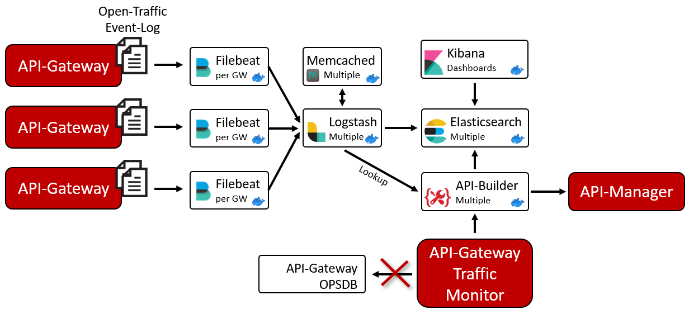
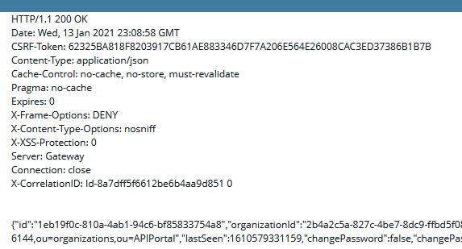

# Axway API-Management using the Elastic-Stack

This project has 3 main objectives in relation to the Axway API management solution.

### Performance

When having many API-Gateway instances with millions of requests the API-Gateway Traffic Monitor can become slow and the observation period quite short. The purpose of this project is to solve that performance issue, make it possible to observe a long time-frame and get other benefits by using a standard external datastore: [Elasticsearch](https://www.elastic.co/elasticsearch).  

Watch this video to see a side by side compare betwen the classical and ElasticSearch based Traffic-Monitor:  
[](https://youtu.be/MUbx4m9EtpY)

### Visibility 

The solution allows API Manager users to use the standard traffic monitor and see only the traffic of their own APIs. This allows API service providers who have registered their APIs to monitor and troubleshoot their own traffic without the need for a central team.  

This video shows how API-Manager users can access the traffic monitor to see their data:  
[](https://youtu.be/rlzi2kAXD4M)

### Analytics

With the help of Kibana, the goal of the project is to deliver standard dashboards that provide analysis capabilities across multiple perspectives.  
It should still be possible to add your own dashboards as you wish.  
This shows a sample dashboard created in Kibana based on the indexed documents:  
<p align="center">

</p>


## Table of content

- [Overview](#overview)
    - [How it works](#how-it-works---overview)
- [Prerequisites](#prerequisites)
- [Getting started](#getting-started)
- [Basic setup](#basic-setup)
  - [Preparations](#preparations)
  - [Elasticsearch](#setup-elasticsearch)
  - [Kibana](#setup-kibana)
  - [Logstash / API-Builder / Memcached](#logstash--api-builder--memcached)
  - [Filebeat](#setup-filebeat)
  - [Kibana Dashboards](#kibana-dashboards)
- [Configure Axway API-Management](#configure-axway-api-management)
  - [Setup Admin-Node-Manager](#setup-admin-node-manager)
  - [Traffic-Monitor for API-Manager Users](#traffic-monitor-for-api-manager-users)
- [Long Term Analytics](#long-term-analytics)
- [GEO-Location](#geo-location)
- [Advanced and production Setup](#advanced-and-production-setup)
  - [Architecture examples](#architecture-examples)
  - [Traffic-Payload](#traffic-payload)
  - [Setup Elasticsearch Multi-Node](#setup-elasticsearch-multi-node)
  - [Setup API-Manager](#setup-api-manager)
  - [Setup local lookup](#setup-local-lookup)
  - [Custom properties](#custom-properties)
  - [Activate user authentication](#activate-user-authentication)
  - [Enable Metricbeat](#enable-metricbeat)
  - [Configure cluster UUID](#configure-cluster-uuid)
  - [Custom certificates](#custom-certificates)
  - [Secure API-Builder Traffic-Monitor API](#secure-api-builder-traffic-monitor-api)
  - [Lifecycle Management](#lifecycle-management)
- [Infrastructure sizing](#size-your-infrastructure)
- [Updates](#updates)
- [Troubleshooting](#troubleshooting)
- [FAQ](#faq)
- [Known issues](#known-issues)

## Overview

The overall architecture this project provides looks like this:  


With that architecture it is possible to collect data from API-Gateways running all over the world into a centralized Elasticsearch instance to have it available with the best possible performance indendent from the network performance.  
It also helps, when running the Axway API-Gateway in Docker-Orchestration-Environment where containers are started and stopped as it avoids to loose data, when an API-Gateway container is stopped.  

Click [here](https://github.com/Axway-API-Management-Plus/apigateway-openlogging-elk/tree/develop/architecture) to find more detailed architecture examples and explanations.  

### How it works - Overview 

Basically, the solution works by importing the log files produced by the API-Gateways around the globe into an Elasticsearch cluster. Once the data has been indexed, it can be used by various clients. One of the clients is of course Kibana to visualize the data in dashboards and furthermore the standard API-Gateway-Manager Traffic-Monitor can access the data.  
All components, besides Filebeat, can be deployed and configured in a highly available way. The role of each component of the solution is discussed below.

### Filebeat

Filebeat runs directly on the API gateways as a Docker container or as a native application. It streams the generated logfiles to the deployed Logstash instances. The OpenTraffic log, Event log, Trace messages and Audit logging are streamed.

### Logstash

Logstash has the task to preprocess the received events before sending them to Elasticsearch. As part of this processing, some of the data (for example, API details) are enriched using APIs provided by the API Builder. This makes it possible to access additional information such as policies, custom properties, etc. in Kibana and other applications. Of course, this information is cached in Memcached.

### API-Builder

The API-Builder has three important tasks. 
1. it provides some REST APIs for Logstash processing. For this purpose, it mainly uses the API Manager REST API to retrieve the information.
2. it provides the same REST API expected by the Traffic-Monitor, but based on Elasticsearch. The Admin Node Manager is then redirected to the API builder traffic monitor API for some of the request.
3. it configures Elasticsearch for the use of this solution. This includes index templates, ILM policies, etc. This makes it easy to update the solution.

### Memcached

Memcached is used by Logstash to cache information retrieved from the API-Builder so that it does not have to be retrieved repeatedly. Among other things, API details are stored.

### Elasticsearch

Ultimately, all information is stored in an Elasticsearch cluster in various indexes and is thus available to Kibana and API-Builder. Of course, once indexed, this data can also be used by other clients.

### Kibana

Kibana can be used to visualize the indexed data in dashboards. The solution provides some default dashboards. However, it is also possible to add custom dashboards to the solution.

### The Traffic-Monitor

The standard API-Gateway Traffic-Monitor which is shipped with the solution is __based on a REST-API__ that is provided by the Admin-Node-Manager. By default the Traffic-Information is loaded from the OBSDB running on each API-Gateway instance. The API-Builder, which is part of this project, is partly __re-implementing this REST-API__, which makes it possible, that the standard Traffic-Monitor is using data from ElasticSearch instead of the internal OBSDB.  
That means, you can use the same tooling as of today, but the underlying implementation of the Traffic-Monitor is now pointing to Elasticsearch instead of the internal OPSDB hosted by each API-Gateway instance. This improves performance damatically, as Elasticsearch can scale across multiple machines if required and other dashboards can be created for instance with Kibana.  
The glue between Elasticsearch and the API-Gateway Traffic-Monitor is an [API-Builder project](./apibuilder4elastic), that is exposing the same Traffic-Monitor API, but it is implemented using Elasticsearch instead of the OPSDB. The API-Builder is available as a ready to use Docker-Image and preconfigured in the docker-compose file.  

## Prerequisites

### Docker

Components such as the API-Builder project are supposed to run as a Docker-Container. The Elasticsearch stack is using standard Docker-Images which are configured with environment variables and some mount points. With that, you are pretty flexible. You can run them with the provided docker-compose or with a Docker Orchestration platform such a Kubernetes or OpenShift to get elastic scaling & self-healing.   

### Docker-Compose or HELM

Docker Compose is one option to deploy the solution. Additionally a [HELM-Chart](helm/README.md) is provided to deploy the solution on Kubernetes or OpenShift.  

### API-Gateway/API-Management

The solution is designed to work with _Classical_ and the _EMT_ API-Management deployment model. As it is mainly based on events given in the Open-Traffic-Event log, these must be enabled. Also Events-Logs are indexed and stored in Elasticsearch. This is used for System-Monitoring information and to highlight annotations based on Governance-Alerts in API-Manager.    
Version __7.7-20200130__ is required due to some Dateformat changes in the Open-Traffic-Format. With older versions of the API-Gateway you will get errors in the Logstash processing.

### Elastic stack

The solution is based on the Elastic-Stack (Elasticsearch, Logstash, Beats and Kibana). It can run completely in docker containers, which for example are started on the basis of docker-compose.yaml or run in a Docker Orchestration Framework.  
It is also possible to use existing components such as an Elasticsearch cluster or a Kibana instance. With that you have the flexiblity to use for instance an Elasticsearch service at AWS or Azure or use Filebeat manually installed on the API-Gateway machines. The solution has been tested with Elasticsearch >7.10.x version.

## Getting started

## Basic setup

The basic setup explains the individual components, how they can be deployed and play together. After completing the basic setup you will have a single node Elasticsearch cluster including a Kibana instance running. This cluster receives data from 1 to N API-Gateways via Filebeat, Logstash, API-Builder and is accessible via the Traffic Monitor. You can also import and use the sample Kibana Dashboard or create your own visualizations.  
  
However, the basic setup uses minimal parameters to run and test the solution on a machine with at least 16 GB of RAM including the API-Management platform _(For instance like the Axway internal API-Management reference environment.)_.  
Therefore, the solution is __not suitable for a production__ environment __without further configuration__. For a production environment, check the parameters mentioned in the [`env-sample`](env-sample) at the beginning and set them if necessary. 

### Preparations

#### Enable Open-Traffic Event Log

Obviously, you have to enable Open-Traffic-Event log for your API-Gateway instance(s). [Read here][1] how to enable the Open-Traffic Event-Log.  
After this configuration has been done, Open-Traffic log-files will be created by default in this location: `apigateway/logs/opentraffic`. This location becomes relevant when configuring Filebeat.  

:point_right: To avoid data loss, it is strongly recommended to increase the disk space for the Open-Traffic logs from 1 GB to at least 8 GB, especially if you have a lot of traffic. If you have for example 100 TPS on 1 API-Gateway, depending on your custom policies, the oldest log file will be deleted after ap. 30 minutes with only 1 GB OpenTraffic log configured. If for any reason Filebeat, Logstash, etc. is not running to process events for more than 15-20 minutes you will have a loss of data as it also takes some time to catch up.

#### Download and extract the release package

Please select the Axway- or Community-Supported release. The community release always reflects the state of development. Please check the [changelog](CHANGELOG.md) to make sure you select the correct version. [Learn more](#is-this-solution-officially-supported-by-axway).  

#### Community-Version
```
wget --no-check-certificate https://github.com/Axway-API-Management-Plus/apigateway-openlogging-elk/releases/download/v4.3.0/axway-apim-elk-v4.3.0.tar.gz -O - | tar -xvz
```

#### Axway Supported-Version
```
wget --no-check-certificate https://github.com/Axway-API-Management-Plus/apigateway-openlogging-elk/releases/download/v4.2.0/axway-apim-elk-v4.2.0.tar.gz -O - | tar -xvz
```

To simplify updates it is recommended to create a Symlink-Folder and finally rename the provided file `env-sample` to `.env`.  
```
ln -s axway-apim-elk-v1.0.0 axway-apim-elk
cd axway-apim-elk-v1.0.0
cp env-sample .env
```

- From this point on it is assumed that all commands are executed within the unpacked release folder.  
- As it is important that the `.env` can be found by Docker-Compose.  
- If, as recommended, you run the solution on different machines, it is also assumed that you download and unpack the release package on each machine. And then provide the `.env` file.  
- Furthermore, it is recommended to store the .env as central configuration file in a version management system.

Even if otherwise possible, it is recommended to deploy the individual components in the following order. For each component you can then check if it is functional.

<p align="right"><a href="#table-of-content">Top</a></p>

### Setup Elasticsearch

Watch this video for a demonstration: [Setup Single Node Elasticsearch cluster](https://youtu.be/x-OdAdV2N7I)  

If you are using an existing Elasticsearch cluster, you can skip this section and go straight to [Logstash/Memcached and APIBuilder4Elastic](#logstash--api-builder--memcached).  

Open the `.env` file and configure the ELASTICSEARCH_HOSTS. At this point please configure only one Elasticsearch node. You can start with a single node and add more nodes later. More about this topic [Multi-Node Deployment](#setup-elasticsearch-multi-node) later in the documenation.  
This URL is used by all Elasticsearch clients (Logstash, API-Builder, Filebeat) of the solution to establish communication.  
If you use an external Elasticsearch cluster, please specify the node(s) that are given to you.  
Please keep in mind that the hostnames must be resolvable within the docker containers. Some parameters to consider to change before starting the cluster::  
```
ELASTICSEARCH_HOSTS=https://my-elasticsearch-host.com:9200
ELASTICSEARCH_CLUSTERNAME=axway-apim-elasticsearch-prod
ES_JAVA_OPTS="-Xms8g -Xmx8g"
```
With the following command you initialize a new Elasticsearch Cluster which is going through an appropriate bootstrapping. Later you can add more nodes to this single node cluster. Please do not use the init extension when restarting the node:  
```
docker-compose --env-file .env -f elasticsearch/docker-compose.es01.yml -f elasticsearch/docker-compose.es01init.yml up -d
```
Wait until the cluster has started and then call the following URL:
```
curl -k GET https://my-elasticsearch-host.com:9200
{
  "name" : "elasticsearch1",
  "cluster_name" : "axway-apim-elasticsearch",
  "cluster_uuid" : "nCFt9WhpQr6JSOVY_h48gg",
  "version" : {
    "number" : "7.16.1",
    "build_flavor" : "default",
    "build_type" : "docker",
    "build_hash" : "d34da0ea4a966c4e49417f2da2f244e3e97b4e6e",
    "build_date" : "2020-09-23T00:45:33.626720Z",
    "build_snapshot" : false,
    "lucene_version" : "8.6.2",
    "minimum_wire_compatibility_version" : "6.8.0",
    "minimum_index_compatibility_version" : "6.0.0-beta1"
  },
  "tagline" : "You Know, for Search"
}
```
At this point you can already add the cluster UUID to the `.env` (`ELASTICSEARCH_CLUSTER_UUID`) file. With that, the Single-Node Elasticsearch Cluster is up & running.

<p align="right"><a href="#table-of-content">Top</a></p>

### Setup Kibana

Watch this video for a demonstration: [Setup Kibana](https://youtu.be/aLODAuXDMzY)  

If you are using an existing Elasticsearch cluster, you can skip this section and go straight to [Logstash/Memcached and APIBuilder4Elastic](#logstash--api-builder--memcached).  

For Kibana all parameters are already stored in the .env file. Start Kibana with the following command:
```
docker-compose --env-file .env -f kibana/docker-compose.kibana.yml up -d
```
You can address Kibana at the following URL Currently no user login is required.
```
https://my-kibana-host:5601
```
If Kibana doesn't start (>3-4 minutes) or doesn't report to be ready, please use docker logs Kibana to check for errors.  

<p align="right"><a href="#table-of-content">Top</a></p>

### Logstash / API-Builder / Memcached

Watch this video for a demonstration: [Setup Logstash and API-Builder](https://youtu.be/lnSjF2tUS8Y)  

It is recommended to deploy these components on one machine, so they are in a common Docker-Compose file and share the same network. Furthermore, a low latency between these components is beneficial. This allows you to use the default values for Memcached and API Builder. Therefore you only need to specify where the Admin-Node-Manager or the API manager can be found for this step. If necessary you have to specify an API-Manager admin user.  
```
ADMIN_NODE_MANAGER=https://my-admin-node-manager:8090
API_MANAGER_USERNAME=elkAdmin
API_MANAGER_PASSWORD=elastic
```

If you are using an existing Elasticsearch cluster and have therefore skipped the previous two sections, please also configure the Elasticsearch hosts, any [necessary users](#activate-user-authentication) and the Elasticsearch [server CA](#custom-certificates) here.

```
ELASTICSEARCH_HOSTS=https://my-existing-elasticsearch-host1.com:9200, https://my-existing-elasticsearch-host2.com:9200, https://my-existing-elasticsearch-host3.com:9200
```

To start all three components the main Docker-Compose file is used:
```
docker-compose up -d
```

Check that the docker containers for Logstash, API Builder and Memached are running.  
```
[ec2-user@ip-172-31-61-59 axway-apim-elk-v1.0.0]$ docker ps
CONTAINER ID        IMAGE                                       COMMAND                  CREATED             STATUS                 PORTS                              NAMES
d1fcd2eeab4e        docker.elastic.co/logstash/logstash:7.12.2  "/usr/share/logstash…"   4 hours ago         Up 4 hours             0.0.0.0:5044->5044/tcp, 9600/tcp   logstash
4ce446cafda1        cwiechmann/apibuilder4elastic:v1.0.0        "docker-entrypoint.s…"   4 hours ago         Up 4 hours (healthy)   0.0.0.0:8443->8443/tcp             apibuilder4elastic
d672f2983c86        memcached:1.6.6-alpine                      "docker-entrypoint.s…"   4 hours ago         Up 4 hours             11211/tcp                          memcached
```
It may take some time (2-3 minutes) until Logstash is finally started. 
```
docker logs logstash
Pipelines running {:count=>6, :running_pipelines=>[:".monitoring-logstash", :BeatsInput, :Events, :DomainAudit, :TraceMessages, :OpenTraffic], :non_running_pipelines=>[]}
Successfully started Logstash API endpoint {:port=>9600}
```
Please note:
- that the Logstash API endpoint (9600) is not exposed outside of the docker container.  
- Logstash is configured not to create indexes or index templates in Elasticsearch. These will be installed later by the API Builder application when the first events are received. The reason is that they may need to be created according to the region.  

<p align="right"><a href="#table-of-content">Top</a></p>

### Setup Filebeat

Watch this video for a demonstration: [Setup Filebeat](https://youtu.be/h0AdztZ2bSE)  

Finally Filebeat must be configured and started. You can start Filebeat as Docker-Container using the Docker-Compose files and mount the corresponding directories into the container. 
Alternatively you can install Filebeat natively on the API gateway and configure it accordingly. It is important that the filebeat/filebeat.yml file is used as base. This file contains instructions which control the logstash pipelines.

The following instructions assume that you set up Filebeat based on filebeat/docker-compose.filebeat.yml. 

:exclamation: __This is an important step, as otherwise Filebeat will not see and send any Event data!__  
Please add the following configuration. At this point you can already configure the filebeat instances with a name/region if you like.
```
APIGATEWAY_LOGS_FOLDER=/opt/Axway/APIM/apigateway/logs/opentraffic
APIGATEWAY_TRACES_FOLDER=/opt/Axway/APIM/apigateway/groups/group-2/instance-1/trace
APIGATEWAY_EVENTS_FOLDER=/home/localuser/Axway-x.y.z/apigateway/events
APIGATEWAY_AUDITLOGS_FOLDER=/home/localuser/Axway-x.y.z/apigateway/logs
GATEWAY_NAME=API-Gateway 3
GATEWAY_REGION=US
```
Audit-Logs are optional. If you don't want them indexed just point to an invalid folder.  
You can find more information for each parameter in the `env-sample`.  

To start Filebeat: 
```
docker-compose --env-file .env -f filebeat/docker-compose.filebeat.yml up -d
```
Use docker logs filebeat to check that no error is displayed. If everything is ok, you should not see anything.  
Check in Kibana (Menu --> Management --> Stack Management --> Index Management) that the indexes are filled with data.

If you encounter issues please see the [Troubleshooting](#troubleshooting) section for help or create an [issue](https://github.com/Axway-API-Management-Plus/apigateway-openlogging-elk/issues). 

<p align="right"><a href="#table-of-content">Top</a></p>

### Kibana Dashboards

To install the Kibana dashboards please use the _Kibana Menu --> Stack Management --> Saved Objects --> Import saved objects_ and select the following file from the release package:  
_kibana/dashboards/7/*.ndjson_  

No matter if you import the dashboards initially or after an update please use the default settings:  
  

You are welcome to create additional visualizations and dashboards, but do not adapt the existing ones, as they will be overwritten with the next update. If you have created your own visualizations/dashboards, they will not be changed by the import.  

<p align="right"><a href="#table-of-content">Top</a></p>

## Configure Axway API-Management

Watch this video for an overview: [Traffic-Monitor & Kibana Dashboard](https://youtu.be/OZ0RNnqE6hs)  

### Setup Admin-Node-Manager
As the idea of this project is to use the existing API-Gateway Manager UI (short: ANM) to render log data now provided by Elasticsearch instead of the individual API-Gateway instances before (the build in behavior), it is required to change the ANM configuration to make use of Elasticsearch instead of the API-Gateway instances (default setup). By default, ANM is listening on port 8090 for administrative traffic. This API is responsible to serve the Traffic-Monitor and needs to be configured to use the API-Builder REST-API instead.

1. Open the ANM configuration in Policy-Studio. 
You can read [here](https://docs.axway.com/bundle/axway-open-docs/page/docs/apim_administration/apigtw_admin/general_rbac_ad_ldap/index.html#use-the-ldap-policy-to-protect-management-services) how to do that.  

2. Import the provided Policy-Fragement (Ver. 7.7.0) `nodemanager/policy-use-elasticsearch-api-7.7.0.xml` from the release package you have downloaded. This imports the policy: "Use Elasticsearch API".  
:point_right: Don't use the XML-File directly from the GitHub Project as it may contain a different certificates.  
The imported policy looks like this:  
<p align="center"></p>

3. Update main policy  
Insert the "Use Elasticsearch API" policy as a callback policy (filter: Shortcut filter)  
into the main policy: `Protect Management Interfaces` and wire it like shown here:  
<p align="center"></p>

It is recommended to disable the audit log for Failure transactions to avoid not needed log messages in the ANM trace file:  
<p align="center"></p>

- :point_right: Before you restart the Admin-Node-Manager process, please open the file:  `<apigateway-install-dir>/apigateway/conf/envSettings.props`  and add the following new environment variable:  `env.API_BUILDER_URL=https://apibuilder4elastic:8443`.  
- :point_right: If you are using [multiple regions](#different-topologiesdomains) you may also configure the appropriate region to restrict the data of the Admin-Node-Manager to the correct regional data. E.g.: `env.REGION=US`.  
- :point_right: Please remember to copy the changed Admin-Node-Manager configuration from the Policy-Studio project folder (path on Linux: `/home/<user>/apiprojects/\<project-name\>`) back to the ANM folder (`\<install-dir\>/apigateway/conf/fed`). Then restart the ANM.

If you would like to learn more about the imported policy, please [click here](nodemanager).

<p align="right"><a href="#table-of-content">Top</a></p>

### Traffic-Monitor for API-Manager Users

Watch this video for a demonstration: [Traffic-Monitor for API-Manager users](https://youtu.be/X08bQPC1sc4)  

In larger companies hundreds of API service providers are using the API Manager or the [APIM-CLI](https://github.com/Axway-API-Management-Plus/apim-cli) to register their own services/APIs. And the service providers require access to the traffic monitor to monitor their own APIs independently. During registration, the corresponding APIs are assigned to API Manager organizations, which logically split them up. But, the standard traffic monitor does not know the organization concept and therefore cannot restrict the view for a user based on the organization of an API.  
This project solves the problem by storing the API transactions in Elasticsearch with the appropriate organization. Then the API organization is used when reading the traffic data from Elasticsearch according to the following rules.

| API-Gateway Manager  | API-Manager   | Restriction | Comment | 
| :---          | :---                 | :---  | :---  |
| **Administrator**    | N/A           | Unrestricted access | A GW-Manager user is considered as an Admin, when is owns the permission: `adminusers_modify` |
| **Operator**         | API-Admin     | All APIs having a Service-Context | By default each API processed by the API-Manager has a Service-Context. Pure Gateway APIs (e.g. /healthcheck) will not be visible.|
| **Operator**         | Org-Admin     | APIs of its own organization | Such a user will only see the APIs that belong to the same organization as himself. |
| **Operator**         | User          | APIs of its own organization | The same rules apply as for the Org-Admin |

#### Setup API-Manager user in API-Gateway Manager

To give API-Manager users an restricted access to the API-Gateway Traffic-Monitor, the user must be configured in the API-Gateway-Manager with the same login name as in the API-Manager. Here, for example, an LDAP connection can be a simplification.  
Additionally you need to know, that by default, all API-Gateway Traffic-Monitor users get unrestricted access only if one of their roles includes the permission: `adminusers_modify`. But typically, only a full API-Administrator has this right and therefore only these users can see the entire traffic. All other users get a restricted view of the API traffic and will be authorized according to the configured authorization configuration described below.  
However, with the parameter: `UNRESTRICTED_PERMISSIONS` you can configure which right(s) a user must have to get unrestricted access.  

#### Customize user authorization

By default, the organization(s) of the API-Manager user is used for authorization to the Traffic-Monitor. This means that the user only sees traffic from his the organization(s) he belongs in API-Manager. From a technical point of view, an additional filter clause is added to the Elasticsearch query, which results in a restricted result set. An example:  `{ term: { "serviceContext.apiOrg": "Org-A" }}`  
   
Since version 2.0.0, it is alternatively possible to use an external HTTP service for authorization instead of the API Manager organizations, to restrict the Elasticsearch result based on other criterias.  

To customize user authorization, you need to configure an appropriate configuration file as described here:  
```
# Copy the provided example 
cp ./config/authorization-config-sample.js ./config/my-authorization-config.js
# Customize your configuration file as needed
vi ./config/my-authorization-config.js
# Setup your .env file to use your authorization config file
vi .env
AUTHZ_CONFIG=./config/my-authorization-config.js
# Recreate the API-Builder container
docker stop apibuilder4elastic
docker-compose up -d
```

In this configuration, which also contains corresponding Javascript code, necessary parameters and code is stored, for example to parse the response and to adjust the Elasticsearch query. The example: [config/authorization-config-sample.js](config/authorization-config-sample.js) contains all required documentation.  

Once this configuration is stored, the API Manager Organization based authorization will be replaced.  

Please note:  
- Besides the API-Manager Organization autorization only `externalHTTP` is currently supported.  
- Only 1 authorization method can be enabled
- It is also possible to disable user authorization completely. To do this, set the parameter: `enableUserAuthorization: false`. 
- If you have further use-cases please create an issue describing the use-case/requirements.  

<p align="right"><a href="#table-of-content">Top</a></p>

## Long Term Analytics

Since version 3.4.0, the solution supports long-term analytics capabilities out of the box in addition to relatively short-term operations and the corresponding Real-Time dashboard.  
For this purpose, the highly granular raw data received from the API-Gateways is transformed into entity-centric indices that are pre-aggregated and require only a fraction of the necessary disk space. Of course, this reduces the ability to analyze data down to the minute.  
To transform the raw data, the solution delivers and automatically installs a ready-made transformation job and provides corresponding [dashboards](imgs/api-requests-quartely-dashboard.png).  

  

It is important to know that the transformation works with a delay of 3 hours. This means that real-time data will appear in the Quartely/Yearly dashboards only after this time. This delay allows you to suspend/interrupt ingesting data for a max. of 3 hours without losing data for the transform and thus long term analytics.  

Please note:    
- Long-Term Analytics data will only be available after approximately 1 hour. Until then, the corresponding dashboards will show errors. For example: _The field "name-of-a-field" associated with this object no longer exists. Please use another field._ Please wait at least 1 hour for the data to be prepared accordingly or create the transformation job manually executing the following command in the APIBuilder4Elastic container:  
`wget --no-check-certificate https://localhost:8443/api/elk/v1/api/setup/transform/apigw-traffic-summary`.

<p align="right"><a href="#table-of-content">Top</a></p>

## Geo-Location

As of version 4.3.0, the solution supports geo-maps to see from which regions API requests are processed.  
These are broken down on the basis of real-time data in a map to the corresponding city and, for historical data, the number of requests per country.

  

The IP address of the client is determined from the Transaction event log, converted to a corresponding location by the Logstash plugin geoip and stored in Elasticsearch. The process is enabled by default, but can be disabled via the XXXX parameter.  

Most likely, your API management solution is running behind a firewall or load balancer, so the actual IP address of the client is not included in the event log. To pass the correct IP address to the solution, please configure a custom attribute (by default `xForwardedFor`) for the transaction event log, which contains the correct IP address. You can obtain this from the X-Forwarded-For header, for example. 

  

## Advanced and production Setup

This section covers advanced configuration topics that are required for a production environment. It is assumed that you have already familiarized yourself with the solution using the Basic setup.  

### Architecture examples

We have started to make [architectural examples](architecture) directly available here. These should help to deploy the solution in different environments. The area is currently under construction.

### Traffic-Payload

The payload belonging to an API request is not written directly to the open traffic event log and therefore not stored in Elasticsearch.  
To clarify what is meant by payload at this point the following example screenshot.  
  
This payload, if not configured as explained below, will only be displayed as long as it is in the OBSDB. After that NO DATA is displayed instead of the payload.  

__1. Payload Export__  

In order to also make the payload available in the Traffic Monitor via the solution, this must also be exported from the API gateway to the runtime.  
To do this, go to the Server Settings Open Traffic Event Log configuration and enable the payload export:  
  
You need to repeat this step for each API gateway group for which you want to make the payload available. You can change the export path if necessary, for example to write the payload to an NFS volume.  

__2. Payload in API-Builder__  

Finally, the saved payload must be made available to the API-Builder Docker container as a mount under: `/var/log/payloads`. You can find an example in the docker-compose.yml:  
`${APIGATEWAY_PAYLOADS_FOLDER}:/var/log/payloads`  
So if the API gateways are running remotely to the API-Builder, as is very likely in production, you will need to either copy/move the payload or mount the network drive to the API-Builder container.  

__3. Regional Payload__  

If you are using the [region feature](#different-topologiesdomains), that is, collecting API-Gateways of different Admin-Node-Manager domains into a central Elasticsearch instance, then you also need to make the payload available to the API builder regionally separated.  

Example:  
You have defined the region as follows:   
`REGION=US-DC1`  
All traffic payload from these API-Gateways must be made available to the API-Builder as follows:  
`/var/log/payloads/us-dc1/<YYY-MM-DD>/<HH.MI>/<payloadfile>`  
So you need to make the existing structure available in a regional folder. For this, the region must be in lower case. And you have to configure each [Admin-Node-Manager with the correct region](#admin-node-manager-per-region).    

Please note:  
:point_right: Payload handling is enabled by default. So it is assumed that you provide the payload to the API Builder container. Set the parameter: `PAYLOAD_HANDLING_ENABLED=false` if you do not need this.  
:point_right: Payload shown in the Traffic-Monitor UI is limited to 20 KB by default. If required the payload can be downloaded completely using the `Save` option. 

<p align="right"><a href="#table-of-content">Top</a></p>

### Setup Elasticsearch Multi-Node

For a production environment Elasticsearch must run a multi-node Elasticsearch cluster environment. Indices are configured so that available nodes are automatically used for primary and replica shards. If you use only one Elasticsearch node, the replica shards cannot be assigned to any node, which causes the cluster to remain in the Yellow state. This in turn leads to tasks not being performed by Elasticsearch. For example, lifecycle management of the indexes.   
If you are using an external Elasticsearch cluster, you can skip most of the following instructions, besides step number 1 to configure your available Elasticsearch cluster nodes.

#### General remarks

The setup of a Multi-Node Elasticsearch Cluster can be done with default settings via the parameter: ELASTICSEARCH_HOSTS. Some hints for this:  
- The default ports are 9200, 9201, 9202 and 9300, 9301, 9302 for the Elasticsearch instances elasticsearch1, elasticsearch2 and elasticsearch3. 
  - these ports are exposed by Docker-Compose through the docker containers
  - please configure ELASTICSEARCH_HOSTS accordingly with 9200, 9201, 9202
  - based on the HTTP ports, the transport port is derived. (9201 --> 9301, ...)
  - other ports are possible and can be configured
- Based on the specified URLs, the necessary Elasticsearch parameters are set when creating or starting the Elasticsearch Docker containers.
- Multiple Elasticsearch Nodes are only really useful if they actually run on different hosts.
  - Again, it is assumed that the release package is downloaded on the individual hosts and the `.env` file is provided. 
- You can always add more nodes to the Elasticsearch cluster to provide additional disk space and computing power.
  - You can start with two nodes today and add another cluster node in 6 months if needed.  
- Note that all clients (Filebeat, Logstash, API-Builder and Kibana) are using the given Elasticsearch hosts
  - that means, you don't need a loadbalancer in front of the Elasticsearch-Cluster to achieve high availability at this point
  - make sure, that all clients are configured and restarted with the available Elasticsearch hosts
  
Watch this video for a demonstration: [Add Elasticsearch node](https://youtu.be/sM5-0c8aEZk)  

__1. Setup Cluster-Nodes__

The solution is prepared for 5 nodes but can easily be extended to more nodes if needed. To configure multiple hosts in the `.env`file: 
```
ELASTICSEARCH_HOSTS=https://ip-172-31-61-143.ec2.internal:9200,https://ip-172-31-57-105.ec2.internal:9201
```
If you need special configuration please use the parameters `ELASTICSEARCH_PUBLISH_HOST<n>`, `ELASTICSEARCH_HOST<n>_HTTP` and `ELASTICSEARCH_HOST<n>_TRANSPORT`

You may also change the cluster name if you prefer: `ELASTICSEARCH_CLUSTERNAME=axway-apim-elasticsearch`

__2. Bootstrap the cluster__

You can skip this step if you want to extend the cluster from the basic setup, since the basic setup has already initialized a cluster.

We recommend starting one node after the next. The first node will initially set up the cluster and bootstrap it.
Start the first cluster node with the following statement:  
```
docker-compose --env-file .env -f elasticsearch/docker-compose.es01.yml -f elasticsearch/docker-compose.es01init.yml up -d
```
This node automatically becomes the master node.

__3. Add additional nodes__

You can add cluster nodes at any time to increase available disk space or CPU performance. 
To achieve resilience, it is strongly recommended set up at least 2 or even better 3 cluster nodes to also perform maintenance tasks such as updates. For more information please read: [Designing for resilience](https://www.elastic.co/guide/en/elasticsearch/reference/current/high-availability-cluster-design.html). It is also possible to have two Elasticsearch nodes running on the same machine.  
  
To add a cluster node you need to configure ELASTICSEARCH_HOSTS and execute the following command:  
```
# To add for instance a third node ELASTICSEARCH_HOSTS must contain three nodes
docker-compose --env-file .env -f elasticsearch/docker-compose.es03.yml up -d
```
If a node has successfully joined the cluster you see the following log message logged in the master node:  
```
{"ty...": "INFO", "component": "o.e.c.s.MasterService", "cluster.name": "axway-apim-elasticsearch", "node.name": "elasticsearch1", "message": "node-join[{elasticsearch3}{eQaH...w"  }
```
Additionally please check in Kibana the new node has successfully joined the cluster and shards are assigned to it.

__4. Restart clients__

Do you have changed the list of available Elasticsearch Nodes via the parameter: ELASTICSEARCH_HOSTS. For example from a single-node to a multi-node cluster, then it is strongly recommended to restart the corresponding clients (Kibana, Filebeat, Logstash, API-Builder). Via docker-compose, so that the containers are created with the new ELASTICSEARCH_HOSTS parameter. 
This ensures that clients can use the available Elasticsearch nodes for a fail-over in case of a node downtime.

<p align="right"><a href="#table-of-content">Top</a></p>

### Configure cluster UUID

This step is optional, but required to monitor your Filebeat instances as part of the stack monitoring. To obtain the Cluster UUID run the following in your browser:  
`https://elasticsearch1:9200/` (if you have already activated authentication you can use the elastic user here)  

Take over the UUID into the .env file:  
`ELASTICSEARCH_CLUSTER_UUID=XBmL4QynThmwg0X0YN-ONA` 

You may also configure the following parameters: `GATEWAY_NAME` & `GATEWAY_REGION` to make you Filebeat instances unique.  

![Monitoring-Overview][Monitoring-Overview]  

To activate these changes the Filebeat service must be restarted. 

<p align="right"><a href="#table-of-content">Top</a></p>

### Setup API-Manager

Before a document is send to Elasticsearch, additional information for the processed API is requested by Logstash from the API-Manager through an API lookup. This lookup is handled by the API-Builder and performed against the configured API-Manager.  
By default the configured Admin Node Manager host is also used for the API-Manager or the configured API-Manager URL:
```
API_MANAGER=https://my.apimanager.com:8075
```

#### Multiple API-Managers

If you have several API-Managers within your domain, you have to configure a mapping of which group (groupId) belongs to which API Manager. The group-id represents the Domain-Group and is attached to each Open-Traffic- or Metric-Event. It's used by Logstash to send the request to the API-Builder Lookup-API and is used there to perform the lookup against the belonging API-Manager.  
The following syntax is used for this:  
```
API_MANAGER=group-2|https://api-manager-1:8075, group-5|https://api-manager-2:8275
```
In this example, all events of `group-2` are enriched with the help of the API manager: `https://api-manager-1:8075` and of `group-5` accordingly with `https://api-manager-2:8275`.

#### Different Topologies/Domains

From version 2.0.0 it is additionally possible to use the solution with __different domains/topologies__. An example are different hubs (e.g. US, EMEA, APAC) each having their own Admin-Node-Manager & API-Manager, but still all API-Events should be stored in a central Elasticsearch instance.  

For this purpose the configurable `GATEWAY_REGION` in [Filebeat](#filebeat) is used. If this region is configured (e.g. US-DC1), all documents from this region are stored in separate indices, which nevertheless enable global analytics in the Kibana dashboards.  

  

Also in this case, the API-Managers must or can be configured according to the Region & Group-ID of the event. Example:  
```
API_MANAGER=https://my-apimanager-0:8075, group-1|https://my-api-manager-1:8175, group-5|https://my-api-manager-2:8275, group-6|US|https://my-api-manager-3:8375, group-6|eu|https://my-api-manager-4:8475
```
In this example, API-Managers are configured per Region & Group-ID. So if an event is processed which has a Region and Group-ID matching the configuration, then the configured API-Manager is used. This includes the lookup for the API details as well as the user lookup for the authorization.  
If the region does not fit, a fallback is made to a group and last but not least to the generally stored API manager.  
A configuration only per region is not possible!

When the API Builder is started, to validate the configuration, a login to each API-Manager is performed. Currently the same 
API manager user (API_MANAGER_USERNAME/API_MANAGER_PASSWORD) is used for each API Manager. 

#### Admin-Node-Manager per Region

If you use the solution with multiple regions and different domains, all events/documents are stored in ONE Elasticsearch. Therefore you also need to tell the Admin-Node-Manager in each region, which data (indices) to use. If you don't do that, the Admin-Node-Manager will show the entire traffic from all regions which may not be desired but is also possible.  
To do this, you need to store the appropriate region, which is also specified in the [Filebeats](#filebeat) for the API gateways, in the `conf/envSettings.props` file and restart the node manager. Example: `REGION=US`  
This way the Admin-Node-Manager will only select data from these regional indexes. Learn more about the [Admin-Node-Manager configuration](nodemanager).

<p align="right"><a href="#table-of-content">Top</a></p>

### Setup local lookup

Starting with version 2.0.0 of the solution, it is optionally possible to use local configuration files for the API lookup in addition to the API Manager. This makes it possible to:
1. Enrich native APIs 
  - APIs that have been exposed natively through the API-Gateway policies not having a context
  - you can configure all information that would normally be retrieved from the API-Manager via this lookup file
    - Organization, API-Name, API-Method-Name, Custom-Properties, ...
  - for example display a `/healthcheck` as `Healthcheck API` in Kibana dashboards
2. Ignore events  
  - Additionall you can ignore OpenTraffc events so that they are not indexed or stored in Elasticsearch.   
  - For example, the path: `/favicon.ico`, as this event does not add value.   

Please note that the local configuration file is used before the API-Manager lookup. If there is a match, no lookup to the API-Manager is performed.  

To enable the local lookup, you must perform the following steps:

__1. Add your config file__
It is best to copy the delivered template: [config/api-lookup-sample.json](config/api-lookup-sample.json) to your config/api-lookup.json. 

```
cp config/api-lookup-sample.json config/api-lookup.json
```

__2. Activate the config file__
In your .env file you must then enable the configuration file to be used by the API-Builder. To do this, configure or enable the following environment variable:  
 
```
API_BUILDER_LOCAL_API_LOOKUP_FILE=./config/api-lookup.json
```

__3. Restart API-Builder__

```
docker stop apibuilder4elastic
docker-compose up -d
```

If an event is to be indexed, the API builder will try to read this file and will acknowledge this with the following error if the file cannot be found:

```
Error reading API-Lookup file: './config/api-lookup.json'
```

#### Ignore APIs/Events

At this point, we intentionally refer to events and not APIs, because different events (TransactionSummy, CircuitPath, TransactionElement) are created in the OpenTraffic log for each API call. Each is processed separately by Logstash and stored using an upsert in Elasticsearch with the same Correlation-ID. Most of these events contain the path of the called API, but unfortunately not all.  
This is especially important when ignoring events so that they are not stored in Elasticsearch entirely. Since all events are processed individually, it must also be decided individually to ignore an event.
Therefore, to ignore for example the Healthcheck API entirely, the following must be configured in the lookup file:
```json
{
    "/healthcheck": {
        "ignore": true,
        "name": "Healthcheck API",
        "organizationName": "Native API"
    },
    "Policy: Health Check": {
        "ignore": true
    }
}
```
This will ignore events based on the path (TransactionSummary & TransactionElement) and the policy name (CircuitPath). 
You can see the result in the API-Builder log on level INFO with the following lines:  
`Return API with apiPath: '/healthcheck', policyName: '' as to be ignored: true`   
or:  
`Return API with apiPath: '', policyName: 'Health Check' as to be ignored: true`  

The information is cached in Logstash via memcached for 1 hour, so you will not see the loglines in the API-Builder for each request. You can of course force a reload of updated configuration via `docker restart memcached`.  

It is additionally possible to overlay the local lookup file per group and region. This allows you, for example, to return different information per region for the same native API or to ignore an API only in a specific region. To do this, create files with the same base name and then a qualifier for the group and/or for the group plus region. Examples:  
```
api-lookup.group-2.json
api-lookup.group-2.us.json
```
Again, it is not possible to specify only the region, but only in combination with the appropriate group.   

<p align="right"><a href="#table-of-content">Top</a></p>

### Custom properties

The solution supports custom properties by default which are configured in the API Manager for APIs. This means that the custom properties are indexed in Elasticsearch and can be used for customer-specific evaluations.
Since version 4.3.0, it is also possible to index runtime properties, i.e. policy attributes, in Elasticsearch and then analyze them in Kibana, for example.

The following steps are necessary:

#### 1. Export the custom attributes 

In Policy Studio, configure which attributes should be exported to the transaction event log. [Learn more](https://docs.axway.com/bundle/axway-open-docs/page/docs/apim_reference/log_global_settings/index.html#transaction-event-log-settings) how to configure messages attributes to be stored in transaction events.   
All exported attributes will be found in the Elasticsearch indices: `apigw-traffic-summary` & `apigw-hourly-traffic-summary` within the field: customMsgAtts. 

#### 2. Configure custom properties

In order to be able to use your attributes in aggregations for reports later on, you have to configure them for the solution in advance.
By using the parameter: `EVENTLOG_CUSTOM_ATTR` you define which attributes should be indexed in Elasticsearch.  
It is important that the fields have as high cardinality as possible to work efficiently in aggregations. The fields are indexed as a keyword in Elasticsearch. It is also possible to index fields as text, but these are not available in the long-term data and not recommended.  

After restarting APIBuilder4Elastic, the solution will configure Elasticsearch (index templates & transform job) according to the parameter: `EVENTLOG_CUSTOM_ATTR`. 
Please note that it takes 4 hours for the custom properties to be available in the transformed data (`apigw-hourly-traffic-summary`).

<p align="right"><a href="#table-of-content">Top</a></p>

### Activate user authentication

Watch this video for a demonstration: [Authentication for Elasticsearch](https://youtu.be/4xxqV7PyBRQ)  

__1. Generate Built-In user passwords__

_This step can be ignored, when you are using an existing Elasticsearch cluster._
Elasticsearch is initially configured with a number of built-in users, that don't have a password by default. So, the first step is to generate passwords for these users. It is assumed that the following command is executed on the first elasticsearch1 node:  
```
docker exec elasticsearch1 /bin/bash -c "bin/elasticsearch-setup-passwords auto --batch --url https://localhost:9200"
```
As a result you will see the randomly generated passwords for the users: `apm_system`, `kibana_system`, `kibana`, `logstash_system`, `beats_system`, `remote_monitoring_user` and `elastic`. These passwords needs to be configured in the provided `.env`. 

__2. Setup passwords__

Please update the `.env` and setup all passwords as shown above. If you are using an existing Elasticsearch please use the passwords provided to you. The `.env` contains information about each password and for what it is used:  
```
FILEBEAT_MONITORING_USERNAME=beats_system
FILEBEAT_MONITORING_PASSWORD=DyxUva2a6CwedZUhcpFH

KIBANA_USERNAME=kibana_system
KIBANA_PASSWORD=qJdDRYyL97lP5ERkHHrj

LOGSTASH_MONITORING_USERNAME=logstash_system
LOGSTASH_MONITORING_PASSWORD=Y6J6vgw9Z0RTPcFR8Qp3

LOGSTASH_USERNAME=elastic
LOGSTASH_PASSWORD=2x8vxZrvXX9a3KdGuA26

API_BUILDER_USERNAME=elastic
API_BUILDER_PASSWORD=2x8vxZrvXX9a3KdGuA26
```

__3. Disable anonymous user__

In the `.env` file uncomment the following line:  
```
ELASTICSEARCH_ANONYMOUS_ENABLED=false
```
With that, anonymous access to the Elasticsearch cluster is not possible anymore, which also includes Kibana.  

__4. Enable user autentication in Kibana__
In the `.env` file also uncomment the following line to enable user authentication in Kibana:  
```
KIBANA_SECURITY_ENABLED=true
```
After restart, Kibana will prompt to login before continue. Intially you may use the `elastic` user account to login and then create individual users and permissions.  

__5. Restart services__

After you have configured all passwords and configured security, please restart all services.  
- Filebeat    - It is now using the beats_system user to send monitoring information
- Logstash    - Using the logstash_system to send monitoring data and logstash user to insert documents
- Kibana      - Is using the kibana_system to send monitoring data
- API-Builder - Is using the API-Builder user to query Elasticsearch
  
It's very likely that you don't use the super-user `elastic` for `API_BUILDER_USERNAME`. It's recommended to create dedicated account.  
The monitoring users are used to send metric information to Elasticsearch to enable stack monitoring, which gives you insight about event processing of the complete platform.

<p align="right"><a href="#table-of-content">Top</a></p>

### Custom certificates

_If you are using an existing Elasticsearch cluster, you have to provide the required CA to the solution to allow certificate validation._

The project is shipped with sample long running certificates/keys that should help you to get started with the solution. For a production environment these certificates and keys should be replaced with custom certificates, as the sample certificates & key are public available on GitHub.  

After you have created the corresponding certificates and keys based on your CA, you must save them in the folder: `certificates`. 
Afterwards these certificates must be configured in the `.env` file.  
```
API_BUILDER_SSL_KEY=config/certificates/corporate-certificate.key
API_BUILDER_SSL_CERT=config/certificates/corporate-certificate.crt
API_BUILDER_SSL_KEY_PASSWORD=dfslkjaskljdklasjdlas
ELASTICSEARCH_CA=config/certificates/corp-ca.crt
ELASTICSEARCH_KEY=config/certificates/corporate-elasticsearch.key
ELASTICSEARCH_KEY_PASSPHRASE=config/certificates/corporate-elasticsearch.crt
ELASTICSEARCH_CRT=config/certificates/corporate-elasticsearch.key
KIBANA_KEY=config/certificates/corporate-kibana.key
KIBANA_CRT=config/certificates/corporate-kibana.crt
```
You can find more information about the individual certificates in the `.env` file.

<p align="right"><a href="#table-of-content">Top</a></p>

### Secure API-Builder Traffic-Monitor API
The API-Builder project for providing access to Elasticsearch data has no access restrictions right now. To ensure only API-Gateway Manager users (topology administrators with proper RBAC role) or other users with appropriate access rights can query the log data, one can expose this API via API-Manager and add security here.

To import the API Builder application REST-API into your API-Manager, you can access the Swagger/OpenAPI definition here (replace docker-host and port appropriately for the container that is hosting the API-Builder project):  
https://docker-host:8443/apidoc/swagger.json?endpoints/trafficMonitorApi

<p align="right"><a href="#table-of-content">Top</a></p>

## Monitoring

It is important that the solution is monitored appropriately and by default Internal-Stack Monitoring is used for this purpose, which monitors the Elasticsearch cluster, Kibana, Logstash and Filebeat. 
You can alternatively use Metricbeat and you can find more guidance in this section on platform monitoring.

### Enable Metricbeat

In the default configuration, the solution uses the so-called self-monitoring. This means that components such as Logstash, Kibana, Filebeat, etc. independently send monitoring information (metrics) to Elasticsearch. However, this approach is not recommended by Elastic and is deprecated.  
Metricbeat should be used instead. Unfortunately, the solution cannot easily be delivered with a pre-configured Metricbeat, as it depends too much on the deployment.   
So this means that you have to set some parameters in the `.env` file and then start Metricbeat.  
You will learn here how to enable Metricbeat and thus monitor Memcache, the running Docker containers in addition to the pure Elastic stack. In the future, it is perhaps planned to monitor the API Manager and the API Builder process in the same way and to provide metrics.  

__1. Activate Metricbeat__

- Check that the `METRICBEAT_USERNAME` & `METRICBEAT_PASSWORD` user is set up correctly. This user must have rights to Kibana (to upload dashboards) and Elasticsearch (to create indexes).  
- Set the parameter: `METRICBEAT_ENABLED=true`. This will be populated when the Metricbeat container starts.  
- Set the parameter `SELF_MONITORING_ENABLED=false` to disable legacy monitoring.  

__2. Configure Metricbeat__

The parameter METRICBEAT_MODULES must be set differently for each host, depending on which services are running on which host.  

| Component              | Description                           | 
| :---                   | :---                                  |
| **elasticsearch**      | Replaces internal monitoring so that Elasticsearch metrics appear in Kibana Stack-Monitoring. __Important:__ ONE metricbeat monitors ALL Elasticsearch nodes based on the parameter: ELASTICSEARCH_HOSTS and Kibana if needed.                                   |
| **kibana**             | Enables monitoring of Kibana analogous to Elasticsearch. You can use a Metricbeat for monitoring Elasticsearch & Kibana as explained. |
| **logstash**           | Monitoring Logstash. Provides the data in Kibana Stack-Monitoring. |
| **filebeat**           | Monitoring Filebeat. Provides the data in Kibana stack-Monitoring. |
| **memcached**          | Captures statistics from Memcached. Is indexed, but currently not used in any dashboard and can be disabled if not needed. |
| **system**             | Provides system metrics such as disk IO, network IO, etc. __Important:__ In the default configuration out of the Docker container which limits the process view. Will be improved in a later release. See example: [System overview](imgs/metricbeat-system-overview.png) or [Host overview](imgs/metricbeat-api-host-overview.png) |
| **docker**             | Provides information about running Docker containers that can be displayed in dashboards. Docker containers are automatically detected on the host. See example: [Docker overview](imgs/containers-overview.png) |

Set the parameter: `METRICBEAT_NODE_NAME` to a descriptive name, which should be displayed later in the Kibana dashboards for the host Metricbeat is running on.  

__3. Start Metricbeat__

Now start the Metricbeat container on each host:
```
docker-compose --env-file .env -f metricbeat/docker-compose.metricbeat.yml up -d
```
On each host a container `metricbeat` started with given configuration in the belonging `.env` file.

__4. Disable Self-Monitoring__

Make sure, the parameter: `SELF_MONITORING_ENABLED=false` is set. Then stop Elasticsearch, Kibana, Logstash & Filebeat services and restart them with docker-compose that they are no longer using self-monitoring. A docker restart is not sufficient here. E.g.
```
docker stop kibana
docker-compose --env-file .env -f kibana/docker-compose.kibana.yml up -d
```
Please note, before restarting an Elasticsearch-Node make sure, the cluster state is green. to stay online during the restart.

<p align="right"><a href="#table-of-content">Top</a></p>

### Enable Application-Performance Monitoring

You can enable Application Performance Monitoring (APM) to monitor APIBuilder4Elastic and other services (e.g. API Builder Services) if required. 


Learn how to set up and activate APM [here](apm).

### Disk-Usage monitoring

It is important that you monitor the disk usage of the Elasticsearch cluster and get alarmed accordingly.  
Elasticsearch also independently monitors disk usage against preconfigured thresholds and closes write operations when the high disk watermark index is exceeded. This means that no more new data can be written.  
To avoid this condition, your alerts should already warn below the Elasticsearch thresholds. The thresholds for Elasticsearch:

- Low watermark for disk usage: 85%.
- High watermark for disk usage: 90% 

So your alerts should report a critical alert before 90%. For more information, please read here: [Disk-based shard allocation settings](https://www.elastic.co/guide/en/elasticsearch/reference/7.16/modules-cluster.html#disk-based-shard-allocation)

## Lifecycle Management

Since new data is continuously stored in Elasticsearch in various indexes, these must of course be removed after a certain period of time.  
Since version 2.0.0, the solution uses the Elasticsearch [ILM](https://www.elastic.co/guide/en/elasticsearch/reference/current/index-lifecycle-management.html) feature for this purpose, which defines different lifecycle stages per index. The so-called ILM policies are automatically configured by the solution with default values using [configuration files](apibuilder4elastic/elasticsearch_config) and can be reviewed in Kibana. Beginning with version 4.1.0, you can also configure the lifecycle of the data yourself according to your requirements.  
The indices pass through stages such as Hot, Warm, Cold which can be used to deploy different performance hardware per stage. This means that traffic details from two weeks ago no longer have to be stored on high-performance machines.  

The configuration is defined here per data type (e.g. Summary, Details, Audit, ...). The following table gives an overview about the default values. The number of days that is crucial for the retention period is the delete days. This gives the guaranteed number of days that the data is guaranteed to be available. More information on how the lifecycle works can be found later in this section. You can use the further phase, for example, to allocate more favorable resources accordingly.

| Data-Type              | Description                                                            | Hot (Rollover) | Warm    | Cold    | __Delete__  |
| :---                   |:---                                                                    | :---           | :---    | :---    | :---        |
| **Traffic-Summary**    | Main index for traffic-monitor overview and primary dashboard          | 30GB / 7d      | 0d      | 5d      | __10d__     |
| **Traffic-Details**    | Details in Traffic-Monitor for Policy, Headers and Payload reference   | 30GB / 7d      | 0d      | 5d      | __10d__     |
| **Traffic-Trace**      | Trace-Messages belonging to an API-Request shown in Traffic-Monitor    | 30GB / 7d      | 0d      | 5d      | __10d__     |
| **General-Trace**      | General trace messages, like Start- & Stop-Messages                    | 30GB / 7d      | 0d      | 5d      | __10d__     |
| **Gateway-Monitoring** | System status information (CPU, HDD, etc.) from Event-Files            | 10GB / 30d     | 0d      | 50d     | __100d__    |
| **Domain-Audit**       | Domain Audit-Information as configured in Admin-Node-Manager           | 10GB / 30d     | 0d      | 300d    | __750d__    |

### Configure the lifecycle

As of version 4.1.0, you can configure how long the indexed data should be kept in Elasticsearch. Before starting, you should read and understand the following information thoroughly, because once deleted, data cannot be recovered.  
Individual API transactions are stored as documents in Elasticsearch Indices. However, it is not the case that individual documents are ultimately deleted again, instead it is always an entire index with millions of transactions/documents. Therefore, you can only control the retention period for an entire index, not per document.  
When API transactions are stored in an index, the size of the index increases accordingly. To prevent an index from growing infinitely, it can be rolled over after a certain time. A new active index is created, which is used to write the data. This replaces the old index, which is only used for reading. This process is called [rollover](https://www.elastic.co/guide/en/elasticsearch/reference/current/index-rollover.html).  

In order not to have to control this process manually, there are so-called [Index Lifecycle Management](https://www.elastic.co/guide/en/elasticsearch/reference/current/index-lifecycle-management.html) (ILM) policies in Elasticsearch, which perform the rollover based on defined rules and then send the index through further phases for various purposes.  

These ILM policies are configured automatically by the solution with default values and are stored and managed for each index in Elasticsearch. The default values result in the data being available for at least 2 weeks.  

If you would like to customize the lifecycle, then you can provide a corresponding configuration file from version 4.1.0 and use the parameter: `RETENTION_PERIOD_CONFIG`. This is used to adapt the ILM policies accordingly.  

Here is an example:  
```json
{
    "retentionPeriods": {
        "apigw-traffic-summary": {
            "rollover": {
                "max_age": "7d",
                "max_size": "15gb"
            }, 
            "retentionPeriod": "7d"
        }, 
        "apigw-traffic-details": {
            "rollover": {
                "max_age": "7d",
                "max_size": "15gb"
            }, 
            "retentionPeriod": "6d"
        }, 
        "apigw-traffic-trace": {
            "rollover": {
                "max_age": "7d",
                "max_primary_shard_size": "15gb"
            }, 
            "retentionPeriod": "5d"
        }
    }
}
```

The configuration is defined per index and is divided into two areas. When should the rollover happen and how many days after the rollover should the data still be available.  
The following figure illustrates the process:  

  

__1. Create your rention period config file__  

Create a new file for your retention period configuration. For example: `config/custom-retention-period.json`. As a template, you can use the file: `config/my-retention-period-sample.json`. 

__2. Define the rollover__  

It is important to understand that the time period until the rollover of an index is not exactly fixed.  
For example, if you specify a maximum age and size for an index, then the index will be rolled over as soon as a condition is met.  

- If the maximum size is too small for your transaction volume, then an index can meet the size condition in less than 24 hours and will be rolled over. 
- If the maximum size is too large, the index will be rolled when it reaches the maximum age (e.g. after 7 days).  

☝️ So how long the data is available from the very beginning to the end of an index is the sum of the period from the index's initial creation to the rollover plus the period until the delete. As the rollover date cannot be defined exactly, you need to monitor your system accordingly and adjust the lifecycle accordingly to get the desired retention time.  

You can use the following conditions for the rollover:
 - `max_age`: Defines the maximum age of an index until it is rolled over
 - `max_size`: The maxium index size. As an index has a Primary and Replica the required disk space is doubled (max_size: 30gb turns it 60gb disk space used)
 - `max_primary_shard_size`: Starting with an Elasticsearch version 7.13, you can also define the maximum shard size of an index. All indexes , except apigw-management-kpis and apigw-domainaudit, have 5 shards. So you have to multiply the specified size by 5.

For more information please read: [ILM Rollover options](https://www.elastic.co/guide/en/elasticsearch/reference/current/ilm-rollover.html#ilm-rollover-options)

__3. Define the retention period__  

With the parameter: `retentionPeriod` you define the time period for which the data is guaranteed to be available. As already described, the time until the rollover of the index adds to this. You can specify only days here.

__4. Apply the configuration__  

The last step is to reference your configuration file in your `.env` file with the parameter: `RETENTION_PERIOD_CONFIG=./config/custom-retention-period.json` and restart API Builder.

`docker-compose stop apibuilder4elastic`
`docker-compose up`

You can check in Kibana whether the ILM policy has been adjusted accordingly. To do this, go to Stack Management --> Index Lifecycle Policies - Open the corresponding policy here and check the phase.

__Further notes:__

- Changes to the ILM-Policy have no influence on indices that have already been rolled over, as these have already entered lifecycle management
- Indexes should not be too small, as this increases the load on Elasticsearch too much. 
  - For each active index there are 5 Primary- and 5 Replica-Shards. 
  - Each shard corresponds to a Lucene instance, which consumes corresponding resources. 
  - The smaller an index, the more indexes, the more shards, the more resources are needed. 
  - Elastic's recommendation is 30GB. The solution does not allow index size below 5GB.
- It's optional to use different hardware per stage  

<p align="right"><a href="#table-of-content">Top</a></p>

## Requirements

### Elastic stack

If you are using an existing Elastic Search environment including Kibana, the following requirements apply.

- Minimal Elasticsearch is version 7.10.x with X-Pack enabled
- Depending on the traffic enough disk-space available (it can be quite heavy depending on the traffic volume)

#### Required users and roles

The following table represents a suggestion of which roles should be created for the solution to work. You are also welcome to divide the roles differently and assign them to the users accordingly.

| Role              | Cluster privileges                                                    | Index privileges                   | Kibana                   |
| :---              | :---                                                                  | :---                               | :---                     | 
| [axway_apigw_write](elasticsearch/usersAndRoles#role-axway_apigw_write) | `monitor`                                                             | `apigw-* - write`                  | No                       | 
| [axway_apigw_read](elasticsearch/usersAndRoles#role-axway_apigw_read)  | `monitor`                                                             | `apigw-* - read`                   | No                       | 
| [axway_apigw_admin](elasticsearch/usersAndRoles#role-axway_apigw_admin) | `monitor`, `manage_ilm`, `manage_index_templates`, `manage_transform` | `apigw-* - monitor, view_index_metadata, create_index`, `apim-* - read,view_index_metadata`| Yes (All or Custom)  | 
| [axway_kibana_write](elasticsearch/usersAndRoles#role-axway_kibana_write)| None                                                                 | None                               | Yes (Analytics All)      | 
| [axway_kibana_read](elasticsearch/usersAndRoles#role-axway_apigw_read) | None                                                                  | None                               | Yes (Analytics Read)     | 

The following table assumes that the same user should also be used for stack monitoring. You can also split this into two users if necessary.

| Username                  | Roles                                                        | Comment                                                        |
| :---                      | :---                                                         | :---                                                           | 
| [axway_logstash](elasticsearch/usersAndRoles#user-axway_logstash)            | `axway_apigw_write`, `logstash_system`                       | Parameter: `LOGSTASH_USERNAME` and `LOGSTASH_SYSTEM_USERNAME`  | 
| [axway_apibuilder](elasticsearch/usersAndRoles#user-axway_apibuilder)          | `axway_apigw_read`, `axway_apigw_admin`                      | Parameter: `API_BUILDER_USERNAME`                              | 
| [axway_filebeat](elasticsearch/usersAndRoles#user-axway_filebeat)            | `beats_system`                                               | Parameter: `BEATS_SYSTEM_USERNAME`                             | 
| [axway_kibana_read](elasticsearch/usersAndRoles#user-axway_kibana_read)         | `axway_apigw_read`, `axway_kibana_read`                      | Read only access to Dashboards                                 | 
| [axway_kibana_write](elasticsearch/usersAndRoles#user-axway_kibana_write)        | `axway_apigw_read`, `axway_kibana_write`                     | Write access to Dashboard, Visualizations and some other information such as ILM-Policies.                      | 
| [axway_kibana_admin](elasticsearch/usersAndRoles#user-axway_kibana_admin)        | `axway_apigw_read`, `axway_apigw_admin`, `axway_kibana_write`, `monitoring_user` | Access to Stack-Monitoring and APM         | 

### Size your infrastructure

The solution is designed to process and store millions of transactions per day and make them quickly available for traffic monitoring and analytics. 
This advantage of being able to access millions of transactions is not free of charge with Elasticsearch, but is available in the size of the disc space provided.
The solution has been extensively tested, especially for high-volume requirements. It processed 1010 transactions per second, up to 55 million transactions per day on the following infrastructure.

#### Sizing recommendations

There are two important aspects for sizing the platform. The [transactions per second](#transactions-per-second), which are to be processed in real time, and the [retention period](#retention-period), which is reflected in the required disk space.

##### Transactions per Second

The number of concurrent transactions per second (TPS) that the entire platform must handle. The platform must therefore be scaled so that the events that occur on the basis of the transactions can be processed (Ingested) in real time. It is important to consider the permanent load. As a general rule, more capacity should be planned in order to also quickly enable catch-up operation after a downtime or maintenance.  

The following table explains what a single component, such as Logstash, Filebeat, ... can process in terms of TPS with INFO Trace-Messages enabled to stay real-time. Please understand these values as the absolute maximum, which do not give any margin upwards for downtimes or maintenance of the platform. More is not possible per component, so obviously more capacity must be planned for production. The tests were performed on a number of [AWS EC2 instances](#test-infrastructure) with the default parameters for this solution. In order to be able to reliably determine the limiting component, all other components were adequate sized and only the component under test was as stated in the table.

| Component               | Max. TPS           | Host-Machine | Config                | Comment |
| :---                    | :---               | :---         | :---                  | :---    | 
| Filebeat                | >300               | t2.xlarge    | Standard              | Test was limited by the TPS the Mock-Service was able to handle. Filebeat can very likely handle much more volume.|
| Logstash                | 530                | t2.xlarge    | 6GB JVM-Head for Logstash  | Includes API-Builder & Memcache on the same machine running along with Logstash. Has processed ap. 3500 events per second. CPU is finally the limiting factor.  A production setup should have two Logstash nodes for high availability, which provides sufficient capacity for most requirements.|
| 2 Elasticsearch nodes   | 480                | t2.xlarge    | 8GB JVM-Heap for each node | Starting with a Two-Node cluster as this should be the mininum for a production setup. Kibana running on the first node.|
| 3 Elasticsearch nodes   | 740                | t2.xlarge    | 8GB JVM-Heap for each node | Data is searchable with a slight delay, but ingesting is not falling behind real-time in general up to the max. TPS.|
| 4 Elasticsearch nodes   | 1010                | t2.xlarge    | 8GB JVM-Heap for each node | |

Please note:  
- Logstash, API-Builder, Filebeat (for monitoring only) and Kibana are load balanced across all available Elasticsearch nodes. An external Load-Balancer is not required as this is handled internally by each of the Elasticsearch clients.
- do not size the Elasticsearch Cluster-Node too large. The servers should not have more than 32GB memory, because after that the memory management kills the advantage again. It is better to add another server. See the [Test-Infrastructure](#test-infrastructure) for reference.

##### Retention period

The second important aspect for sizing is the retention period, which defines how long data should be available. Accordingly, disk space must be made available.  
In particular the Traffic-Summary and Traffic-Details indicies become huge and therefore play a particularly important role here. The solution is delivered with default values which you can read [here](#lifecycle-management). Based on the these default values which result in ap. __14 days__ the following disk space is required.

| Volume per day           | Total Disk-Space  | Comment |
| :---                     | :---              | :---    |
| up to 1 Mio  (~15 TPS)   | 100 GB            | 2 Elasticsearch nodes, each with 50 GB  |
| up to 5 Mio  (~60 TPS)   | 200 GB            | 2 Elasticsearch nodes, each with 100 GB |
| up to 10 Mio (~120 TPS)  | 250 GB            | 2 Elasticsearch nodes, each with 125 GB |
| up to 25 Mio (~300 TPS)  | 750 GB            | 3 Elasticsearch nodes, each with 250 GB |
| up to 50 Mio (~600 TPS)  | 1.5 TB            | 4 Elasticsearch nodes, each with 500 GB |

Tests were performed with log level __INFO__. If you run your API gateways with DEBUG or have an unusually high number of log messages, more disk space may be necessary.  

:point_right: Please note that when Elasticsearch is started by Docker-Compose, its data is stored in an external volume. This is located at `/var/lib/docker` by default. So you need to make sure that the available space is allocated there.  


If the required storage space is unexpectedly higher, then you can do the following:  
- add an additional Elasticsearch cluster node at a later time.  
  - Elasticsearch will then start balancing the cluster by moving shards to this new node  
  - this additional node will of course also improve the overall performance of the cluster  
- increase the disk space of an existing node  
  - if the cluster state is green, you can stop a node, allocate more disk space, and then start it again
  - the available disk space is used automatically by allocating shards  

#### Test infrastructure

The following test infrastructure was used to determine the [maximum capacity or throughput](#transactions-per-second). The information is presented here so that you can derive your own sizing from it.

| Count | Node/Instance              |CPUS     | RAM   |Disc  | Component      | Version | Comment | 
| :---: | :---                       | :---    | :---  | :--- | :---           | :---    | :---    |
| 6x    | AWS EC2 t2.xlarge instance | 4 vCPUS | 16GB  | 30GB | API-Management | 7.7-July| 6 API-Gateways Classical deployment, Simulate Traffic based on Test-Case |
| 4x    | AWS EC2 t2.xlarge instance | 4 vCPUS | 16GB  | 30GB | Logstash, API-Builder, Memcached | 7.10.0  | Logstash instances started as needed for the test. Logstash, API-Builder and Memcache always run together |
| 5x    | AWS EC2 t2.xlarge instance | 4 vCPUS | 16GB  | 80GB | Elasticsearch  | 7.10.0  | Elasticsearch instances started as needed. Kibana running on the first node |

There is no specific reason that EC2 t2.xlarge instances were used for the test setup. The deciding factor was simply the number of CPU cores and 16 GB RAM.  

##### Memory usage

To give you a good feel for the memory usage of the individual components, the following table shows the memory usage at around 330 transactions per second.

| Component      | Memory usage | Comment                                                                                                                  |
| :---           | :---         | :---                                                                                                                     |
| Elasticsearch  | 5.8 GB       | Configured to max. 8 GB, 5 Elasticsearch Hosts in total                                                                  |
| Kibana         | 320 MB       | One Kibana instance running on along with first Elasticsearch host                                                       |
| Logstash       | 4.5 GB       | Configured to max. 6 GB, 4 Logstash processes running in total                                                           |
| API-Builder    | 110-120 MB   | 4 API-Builder docker containers running in total                                                                         |
| Memcached      | 10-11 MB     | 4 Memcache instances. Memory finally depends on number of unique APIs, Apps, etc. However, very unlikely more than 30 MB |
| Filebeat       | 130 MB       | Filebeat is running as a Docker-Container along the API-Gateway. Filebeat itself is using ap. 30-35 MB.                  |

<p align="right"><a href="#table-of-content">Top</a></p>

## Updates

This solution will be further developed and therefore further releases will be published. 
With each release the following artifacts may change:  

- All Docker-Compose files
- Elasticstack Version
- Logstash Pipelines
- Elasticsearch Configuration (e.g. Index Templates, ILM-Policies, Transformations)
- Filebeat Configuration
- API Builder Docker Container Version
- Kibana Dashboards
- Scripts, etc. 

All components of this solution play together and only work if they are from the same release. The solution checks if for example the index templates have the required version. 
With each update there will be a changelog, release notes and instructions for the update. For each component it is explained whether there have been changes and how to apply them if necessary.  

:exclamation: It is strongly discouraged to make changes in any files of the project, except the `.env` file and the config folder. These will be overwritten with the next release. This is the only way to easily update from one version to the next.
If you encounter a problem or need a feature, please open an issue that can be integrated directly into the solution.  
Of course you are welcome to create your own Kibana dashboards or clone and customize existing ones.  
However, if you need to change files, it is recommended to make this change automatically and repeatable (e.g. https://www.ansible.com). 

[Learn more](UPDATE.md) how to update the solution. 

<p align="right"><a href="#table-of-content">Top</a></p>

## Troubleshooting

- [Check processes/containers are running](#check-processescontainers-are-running)
- [Check Filebeat is picking up data](#check-filebeat-is-picking-up-data)
- [Check Logstash processing](#check-logstash-processing)
- [Check ANM](#check-anm)
- [vm.max_map_count is too low](#vmmax_map_count-is-too-low)
- [No results from Elasticsearch](#no-results-from-elasticsearch)
- [Check API-Builder processing](#check-api-builder-processing)
- [Check requests from Admin-Node-Manager](#check-requests-from-admin-node-manager)
- [Check queries send to ElasticSearch](#check-queries-send-to-elasticsearch)
- [ILM Rollover alias error](#ilm-rollover-alias-error)
- [Check Caching](#check-caching)
- [Certificate error Admin-Node Manager to API-Builder](#certificate-error-admin-node-manager-to-api-builder)
- [Filebeat - Failed to publish events](#filebeat-failed-to-publish-events)
- [Kibana - Missing Long-Term-Statistics](#kibana-missing-long-term-statistics)

### Check processes/containers are running
From within the folder where the docker-compose.yml file is located (git project folder) execute: 
```
docker-compose inspect
                              Name                                             Command                  State                           Ports                     
------------------------------------------------------------------------------------------------------------------------------------------------------------------
apigateway-openlogging-elk_elk-traffic-monitor-api_1_3fbba4deea37   docker-entrypoint.sh node .      Up (healthy)   0.0.0.0:8889->8080/tcp                        
apigateway-openlogging-elk_filebeat_1_3ad3117a1312                  /usr/local/bin/docker-entr ...   Up             0.0.0.0:9000->9000/tcp                        
apigateway-openlogging-elk_logstash_1_c6227859a9a4                  /usr/local/bin/docker-entr ...   Up             0.0.0.0:5044->5044/tcp, 9600/tcp              
elasticsearch1                                                      /usr/local/bin/docker-entr ...   Up             0.0.0.0:9200->9200/tcp, 0.0.0.0:9300->9300/tcp
```
Depending on the services you enabled/disbaled you see the status of each container.

### Check Filebeat is picking up data
You need to check the filebeat Log-File within the running docker container.   
`docker exec -it apigateway-openlogging-elk_filebeat_1_3ad3117a1312 bash`  
`cd logs`  
`tail -f filebeat`  
Make sure, the Filebeat Harvester is started on the Open-Traffic-Files:
```
INFO	log/harvester.go:251	Harvester started for file: /var/log/work/group-2_instance-1_traffic.log
```
The following error means, Logstash is not running or reachable (Or just not yet fully started):
```
ERROR	pipeline/output.go:100	Failed to connect to backoff(async(tcp://logstash:5044)): lookup logstash on 127.0.0.11:53: no such host
```
General note: You don't see Filebeat telling you, when it is successfully processing your log-files. When the Harvester process is started and you don't see any errors, you can assume your files are processed. 
If the Filebeat-Harvester doesn't start, you may validate that the Open-Traffic-Event log files are visible by checking the following directory within the running container:
```
ls -l /var/log/work
-rw-rw-r--. 1 filebeat filebeat  2941509 Aug 13 12:38 group-2_instance-1_traffic.log
-rw-rw-r--. 1 filebeat filebeat 20972249 Jul  7 19:32 group-2_instance-1_traffic_2020-07-07-1.log
-rw-rw-r--. 1 filebeat filebeat 20972436 Jul  8 18:08 group-2_instance-1_traffic_2020-07-08-1.log
-rw-rw-r--. 1 filebeat filebeat 20972005 Jul 17 07:32 group-2_instance-1_traffic_2020-07-17-1.log

```
<p align="right"><a href="#table-of-content">Top</a></p>

### Check Logstash processing
Logstash writes to Stdout, hence you can view information just with:
```
docker logs logstash -f
```
When Logstash is successfully started you should see the following:
```
docker logs logstash
Pipelines running {:count=>6, :running_pipelines=>[:".monitoring-logstash", :DomainAudit, :Events, :TraceMessages, :BeatsInput, :OpenTraffic], :non_running_pipelines=>[]}
Successfully started Logstash API endpoint {:port=>9600}
```
If you see the following or similar error message during processing of events the API-Builder Lookup-API cannot be reached. In case, please make sure the environment variable: `API_BUILDER_URL`is set correctly.
```
[2020-08-19T10:51:05,671][ERROR][logstash.filters.http    ][main][......] error during HTTP request {:url=>"/api/elk/v1/api/lookup/api", :body=>nil, :client_error=>"Target host is not specified"}
```

### Check ANM 
If the Admin-Node-Manager, i.e. the Traffic-Monitor UI, does not fetch the data from Elasticsearch via API-Builder, it is recommended to check the ANM trace file.
Possibly errors like the following are logged there:
```
ERROR   07/Dec/2020:01:43:19.769 [262e:27ebcd5f0601b4bda7f620b5]         java exception: 
java.lang.RuntimeException: java.net.URISyntaxException: Illegal character in path at index 0: [invalid field]/api/elk/v1/api/router/service/instance-1/ops/search?format=json&field=leg&value=0&count=1000&ago=24h&protocol=http
```
In this case, the environment variable: [API_BUILDER_URL](#admin-node-manager) is not set for the ANM process.  

It can also be useful to use the Developer tools (Network monitor) in your browser (e.g. [Chrome](https://developer.chrome.com/docs/devtools/network/reference/) or [Firefox](https://developer.mozilla.org/en-US/docs/Tools/Network_Monitor)) to check the result of API requests in the Traffic Monitor. This way you can directly see the error when the API-Builder could not perform the request.
Here is an example:  
  

### Check Elasticsearch processing
It takes a while until Elasticsearch is finally started and reports it with the following line: 
```
docker logs elasticsearch1 --follow
```
When Elasticsearch is finally started:
```
"level": "INFO", "component": "o.e.c.r.a.AllocationService", "cluster.name": "elasticsearch", "node.name": "elasticsearch1", "message": "Cluster health status changed from [RED] to [YELLOW] (reason: [shards started [[.kibana_1][0]]]).", "cluster.uuid": "k22kMiq4R12I7BSTD87n5Q", "node.id": "6TVkdA-YR7epgV39dZNG2g"  }
```
Status YELLOW is expected when running Elasticsearch on a single node, as it cannot achieve the desired replicas. You may use Kibana Development tools or curl to get additional information.

<p align="right"><a href="#table-of-content">Top</a></p>

### vm.max_map_count is too low
```
ERROR: [1] bootstrap checks failed
[1]: max virtual memory areas vm.max_map_count [65530] is too low, increase to at least [262144]
```
Run the following to set it temporarly:
`sudo sysctl -w vm.max_map_count=262144`
Or the following:
```
1. sudo vi /etc/sysctl.conf
2. add vm.max_map_count=262144
3. sudo service sysctl restart
```

### No results from Elasticsearch
If you don't get any results from Elasticsearch for valid queries an [index template](https://www.elastic.co/guide/en/elasticsearch/reference/7.14/index-templates.html) might not be applied correctly during index creation. You need to know, that Elasticsearch does not execute queries on the original document, rather on the indexed fields. How these were indexed is defined by an index mapping.  
For this purpose, the solution delivers an index template for each index, which is used when the index is created.  
You can find the index mapping in the API-Builder container: `elasticsearch_config/<index-name>/index_template.json` or you can review them [here](apibuilder4elastic/elasticsearch_config).  
To check if the index mapping was applied correctly to an index execute the following request. For example the Traffic-Summary index:  
`http://elasticsearch:9200/apigw-traffic-summary/_mapping`  
then check if properties mappings defined in the configuration mentioned above have been applied to the index.

<p align="right"><a href="#table-of-content">Top</a></p>

### Check API-Builder processing
The API-Builder docker container is running 
```
docker logs apibuilder4elastic --follow
```
```
server started on port 8443
```
### Check requests from Admin-Node-Manager
When using the API-Gateway Traffic-Monitor to monitor requests and having the Admin-Node-Manager re-configured you should see how API-Builder is processing the requests:
```
Request {"method":"GET","url":"/api/elk/v1/api/router/service/instance-1/ops/search?format=json&field=leg&value=0&count=1000&ago=10m&protocol=http","headers":{"host":"localhost:8889","max-forwards":"20","via":"1.0 api-env (Gateway)","accept":"application/json","accept-language":"en-US,en;q=0.5","cookie":"cookie_pressed_153=false; t3-admin-tour-firstshow=1; VIDUSR=1584691147-TE1M3vI9BFWgkA%3d%3d; layout_type=table; portal.logintypesso=false; portal.demo=off; portal.isgridSortIgnoreCase=on; 6e7e1bb1dd446d4cd36889414ccb4cb7=8g9p3kh27t1se22lu6avkmu0a1; joomla_user_state=logged_in; 220b750abfbc8d2f2f878161bab0ab65=62gr71dkre858nc0gjldri18gt","csrf-token":"8E96374767C47BFADC9C606FF969D7CF56FB3F9523E41B34F3B3B269F7302646","referer":"https://api-env:8090/","user-agent":"Mozilla/5.0 (Windows NT 10.0; Win64; x64; rv:74.0) Gecko/20100101 Firefox/74.0","x-requested-with":"XMLHttpRequest","connection":"close","x-correlationid":"Id-fd7c745ebfaed039b2155481 1"},"remoteAddress":"::ffff:172.25.0.1","remotePort":55916}
Response {"statusCode":200,"headers":{"server":"API Builder/4.25.0","request-id":"35fb859d-00b0-404b-97e6-b549db17f84c","x-xss-protection":"1; mode=block","x-frame-options":"DENY","surrogate-control":"no-store","cache-control":"no-store, no-cache, must-revalidate, proxy-revalidate","pragma":"no-cache","expires":"0","x-content-type-options":"nosniff","start-time":"1584692477587","content-type":"application/json; charset=utf-8","response-time":"408","content-md5":"e306ea2d930a3b80f0e91a29131d520b","content-length":"267","etag":"W/\"10b-2N+JsHuxDxMVKhJR1A8GuNGnKDQ\"","vary":"Accept-Encoding"}}
```

If you do not see any requests arriving in the API builder, the ANM may not be able to reach the API builder listen socket.
It is important to know that traffic information will still appear in this case, because in this case the OPSDB will be used. You should therefore check the ANM trace log.
```
tail -f /opt/Axway/APIM/apigateway/trace/nodemanageronapi-env_20200813000000.trc
```

### Check queries send to ElasticSearch
In oder to see queries that are send to ElasticSearch by API-Builder you need to run the Docker-Container with `LOG_LEVEL=debug`. You can activate debug in the docker-compose.yml. This gives you in the console of the API-Builder the following output:  
```
Using elastic search query body: {"index":"logstash-openlog","body":{"query":{"bool":{"must":[{"range":{"timestampOriginal":{"gt":1587541496568}}},{"term":{"processInfo.serviceId":"instance-1"}}]}}},"size":"1000","sort":""}
```
This helps you to further analyze if ElasticSearch is returning the correct information for instance using the Kibana development console. Example sending the same request using the Kibana Development console:  
![Kibana Dev-Console][img8]

<p align="right"><a href="#table-of-content">Top</a></p>

### ILM Rollover alias error
If the solution is configured with different regions, you may see the following error in Kibana or in the Elasticsearch logs:
```
index.lifecycle.rollover_alias [apigw-traffic-summary] does not point to index [apigw-traffic-summary-us-dc1-000002]
```
When an index is rolled, for example because the configured size, time has been reached or due to an update, a new index is created based on the corresponding index template. In this template the ILM rollover alias is configured, which does not match the index if it is regional. 
The API Builder checks periodically (every 10 minutes) if the ILM rollover alias is correct and adjusts it if necessary. 
You can also start this modification manually:
```
docker exec apibuilder4elastic wget --no-check-certificate https://localhost:8443/api/elk/v1/api/setup/index/rolloverAlias -O/dev/null
```

Additionally you may set the index rollover alias to the correct value using for example this request:
```
PUT /apigw-trace-messages-eu-000001/_settings
{
  "index" : {
    "lifecycle.rollover_alias" : "apigw-trace-messages-eu"
  }
}
```

<p align="right"><a href="#table-of-content">Top</a></p>

### Check Caching

The solution uses Memcache in API Builder & Logstash to avoid unnecessary duplicate queries for APIs and users. To check if entries are cached correctly, you can connect to the memcached via `telnet localhost 11211`. Some examples how to use it. 

#### Get slabs
Memcache is storing the data into slabs, which are like chunks depending 

```
stats cachedump 2 0
ITEM ignoredAPIs:###Health Check [19 b; 1610535266 s]
ITEM ignoredAPIs:/healthcheck### [19 b; 1610535266 s]
ITEM index_status:events###N/A [27 b; 1610538266 s]
ITEM index_status:trace###N/A [27 b; 1610538266 s]
ITEM index_status:openlog###N/A [27 b; 1610538266 s]
END
```
You may also try `stats cachedump 1 0` instead. The example above shows that the index_status 

To get a key, for instance the version check status:
```
get version_status:versionCheck
VALUE version_status:versionCheck 1 89
{I"
   message:ETI"'Filebeat and Logstash version okay;TI"versionStatus;TI"ok;T
END
```

You can find additional information here: https://techleader.pro/a/90-Accessing-Memcached-from-the-command-line. You may also use [PHPMemcachedAdmin](https://github.com/elijaa/phpmemcachedadmin) to get insights about the Memcache instance.

### Certificate error Admin-Node Manager to API-Builder

If you have errors connecting from the Admin Node Manager to the API Builder, then the following instructions:
Please make sure that the Admin-Node Manager has imported the correct CA.  
If you connect to the API Builder using a hostname other than `apibuilder4elastic`, you may receive the following error message:  
`The certificate was not issued by the domain issuer`  
To solve the problem you can create a [remote host](https://docs.axway.com/bundle/axway-open-docs/page/docs/apim_policydev/apigw_gw_instances/general_remote_hosts/index.html) and disable the hostname validation (`Verify server’s certificate matches requested hostname`). Or you can use your own matching keys & [certificates](#custom-certificates).  
Another reason might be a missing or expired license for the Admin-Node-Manager. Please see: https://support.axway.com/kb/178766/language/en

<p align="right"><a href="#table-of-content">Top</a></p>

### Filebeat - Failed to publish events

If you see the following error message in the filebeat log:  
`failed to publish events: write tcp 172.23.0.2:55204->172.31.48.67:5044: write: connection reset by peer`  
This means that Logstash could not accept any more events. This does not automatically mean that Logstash instances have to be added, but can also mean that the Elasticsearch cluster can not process any more events.  
The following options:
- Check the CPU utilization of the Logstash nodes. Restart them if necessary. 
- It sounds crazy, but it can help not to specify the logstash hosts in the same order on every filebeat.  
- Check that the Logstash instances have configured all available Elasticsearch nodes.  
- Add more Logstash nodes on a test basis, if that doesn't improve things, add an Elasticsearch node.  

<p align="right"><a href="#table-of-content">Top</a></p>

### Kibana - Missing Long-Term-Statistics

If the Quarterly and Yearly API request processing dashboards do not display any data, check if the transform job: `apigw-traffic-summary-hourly-v<n>` is running and started. The API-Builder4Elastic application tries to create this job every hour. You can also start this with the following API request in the API-Builder container:
```
docker exec apibuilder4elastic wget --no-check-certificate https://localhost:8443/api/elk/v1/api/setup/transform/apigw-traffic-summary
```
If the job exists, check if the index: `apigw-hourly-traffic-summary-00000<n>` exists. If not, please stop the transform job and start it again. If necessary check the messages of the transform job. If the index exists but does not contain any documents, please delete it and restart the transform job.  
Finally you can check if the index pattern: `apigw-hourly-traffic-summary*` exists. If not, please re-import the Kibana dashboard configuration: `Axway-api-overview.ndjson`.  

If the __API-Status history__ and __API-Gateway status history__ in the Quarterly or Yearly-Dashboards are not shown, please do the following.  
- Stop and Delete the Transform-Job: `apigw-traffic-summary-hourly-v<n>`
- Delete the hourly index: `apigw-hourly-traffic-summary-00000<n>` 
- and either wait for max. 60 minutes until API-Builder has re-created the transform or call the REST-API as shown above

The main cause of this problem is the way the `http.status` field is indexed, which was changed in the update to version 3.4.0. If no documents have been received after the upgrade and initial creation of the transformation job, the transformation does not correctly index the `http.status.keyword` field.  

<p align="right"><a href="#table-of-content">Top</a></p>

## FAQ

### Do I need an API-Builder subscription?

No, the delivered API builder Docker image includes the community version and is supported as part of this project.

### Do I need an Elastic subscription?

The solution can be operated in production without a subscription and is thereby community-supported. In this case, open an issue on this GitHub project.
If you need official Elastic support to run your Elastic-Stack or additional features like alerts or machine learning for operation, then you need a subscription to Elastic.
You can find more information here: https://www.elastic.co/pricing/

### Is this solution officially supported by Axway?

Yes, the solution is supported by Axway. A distinction is made between Community and Axway Supported releases, which are marked accordingly in the release directory. For example, currently version 4.2.0 is Axway supported and accordingly you can create normal Axway support cases.  

#### Axway Supported Release

Aligned with the Axway API-Management release cycle, 1 community release is selected at a time, tested with the Axway API-Management solution, and finally marked as Axway supported. From this point on, this will be the Axway Supported Release and there will be bug fixes for it as needed, but no new features. Therefore, there is always only 1 Axway supported release.  
However, this does __not__ mean that the Elastic solution will only work with the corresponding Axway API-Management release, but rather that there will be no more bug fixes for other releases. If you find a bug in a release that is no longer supported, you will need to upgrade to the next Axway Supported version to get a bug fix.  

#### Community Releases

All other releases are community releases, which are released independently of the Axway API-Management release cycle. These always represent the latest state of features and bug fixes. For these releases, you receive community support according to the best-effort approach. Report issues, feature requests, etc. as an issue directly on the GitHub project.

### Do I need to be an Elastic-Stack expert?

No, you do not need to be or become an expert on the Elastic stack. The solution configures the Elasticsearch cluster automatically including future updates, Logstash & Filebeat are preconfigured with the determined optimal parameters for the solution.

### Do I need a specific API-Gateway version to use this solution?

Any API-Gateway version that supports the Open-Traffic event log is supported. However, the solution has been tested with version 7.7-July, but in general it should also work with version 7.6.2.

### Will indexed data be deleted automatically?

Yes, as of version 2.0.0, each index created in Elasticsearch is assigned an Index Lifecycle Policy ([ILM](https://www.elastic.co/guide/en/elasticsearch/reference/current/index-lifecycle-management.html)). This controls how long data is retained for each data type. Learn more [here](#lifecycle-management).

### Can I use this solution for multiple stages?

Technically this would certainly be possible, but definitely not recommended, as you would be mixing data from different stages, such as Prod, Test, Dev. You could certainly separate these with regions in individual indexes, but it still complicates the setup and data management. 
Another reason are updates of the solution which should certainly be done on a test environment before updating the production environment.

### Can I use my own existing Elasticsearch cluster?

Yes, you can use your own Elasticsearch cluster. As long as it's a >7.10.x version with X-Pack features enabled it's supported. For instance AWS-Elasticsearch service does not provide X-Pack is therefore not supported. Additionally >7.10 is required to run the transformation job correctly (See [here](https://github.com/elastic/elasticsearch/pull/59591) for more details about missing buckets).

### Does the solution support high availability?

Yes, all components can be deployed in way to support HA for the entire platform? Load-Balancing is done internally, so no load balancers are required.

### Can I use the Filebeat version shipped with the API-Gateway?

No, as it is not a 7.x version and not tested with this solution at all.

### Can I run Filebeat as a native process?

Yes, you can run Filebeat natively instead of a Docker-Container if you prefer. As long as you are using the filebeat.yml and correct configuration that is supported. However, the solution has been tested with Filebeat 7.9, 7.10, 7.11 & 7.12. If you see performance degregation with an 'old' Filebeat the first advice would be to upgrade the Filebeat version.

### What happens if Logstash is down for a while?

In case Logstash is stopped, Filebeat cannot sent events any longer to Logstash. However, Filebeat remembers the position of the last sent events on each files and resumes at that position, when Logstash is available again. Of course, you have to make sure, files are available long enough. For instance the OpenTraffic-Event Logs are configured by default to 1GB, which is sufficient for around 30 minutes when having 300 TPS. You should increase the disk space.

### What happens if Filebeat is down for a while?

Filebeat stores the current position in a file (registry) storeing which events have already been passed on. If Filebeat is shut down cleanly and then restarted, Filebeat will pick up where it left off.
Tests have shown that it can still be that a few events are lost.

### Can I run multiple Logstash instances?

Yes, Logstash is stateless (besides what is stored is Memcache), hence you can run as many Logstash instances as you like or need. In that case you have to provide multiple Logstash instances using the parameter `LOGSTASH_HOSTS` to the Filebeat instances so that they can load balance the events.

### Can I run multiple API-Builder instances?

Yes, and just provide the same configuration for each API-Builder Docker-Container. It's recommended to run the API-Builder process along Logstash & Memcache as these components are working closely together. Especially a low latency between Logstash & Memcache is crucial.

### Are there any limits in terms of TPS?

The solution was tested up to a maximum of 1,000 TPS and was thus able to process the events that occurred in real time. You can read more details in the [Infrastructure Sizing](#size-your-infrastructure) section. 
The solution is designed to scale to 5 Elasticsearch nodes as the indicies are configured on 5 shards. This means that Elasticsearch distributes each index evenly across the available nodes. 
More Elasticsearch nodes can also have an impact as there are a number of indices (e.g. per region, per type) and this allows Elasticsearch to balance the cluster even better.
So in principle, there is no limit. Of course, the components like Logstash/API builder then need to scale as well.

### Can I customize / change the solution to my needs?

It is not recommended that you change the solution just by hacking/changing some of the files, as they are very likely be overwritten with the next version. With that, you will break the option to upgrade to a newer version. See [here](#updates) for more details.

### Are Trace-Messages stored in Elasticsearch?

Yes. Trace-Messages you see in the Traffic-Monitor for an API-Request are retrieved from the Elasticsearch cluster. Please have in mind, running an API-Gateway in DEBUG mode, handling millions of transactions a day, will signifcantly increase the disk-space requirements in Elasticsearch and the number of events to be processed. When enabling DEBUG, please monitor your Elasticsearch stack if event processing stays real-time.

### Can passwords given in the .env file be encrpyted?

No, but this file is used by docker-compose only. If you would like to avoid to have sensitive data stored, the recommended approach it deploy the solution in Kubernetes environment and store passwords in the Secure-Vault. With that, sensitive data is injected into the containers from a secure source.

### Why does Kibana dashboards show different volumes than the Traffic Monitor?

If the traffic monitor dashboard shows significantly more transactions than the Kibana dashboards, for example for the last 10 minutes, very likely the ingestion rate is not high enough. In other words, the ELK stack cannot process the data fast enough. If the behavior does not recover, you may need to add more Logstash and/or Elasticsearch nodes.

### Can I increase the disk volume on an Elasticsearch machine?

Yes, all indicies are configured to have one replica and therefore it's safe to stop a machine, increase the disk-space and restart it. Please make sure, the cluster state is green, before stopping an instance. The increased volume will be automatically detected by Elasticsearch and used to assign more shards to it. It's recommended to assign the same disk space to all Elasticsearch-Cluster nodes.

### During catch up, what should be the total events rate for Filebeat?

Tests show that Filebeat can send more than 3,000 events per second to Logstash instances. Of course, this number also depends on the event type. Trace messages can be processed faster than OpenTraffic event logs, for example. You can find an example [here](imgs/stack-monitoring/stack-monitoring-beats-instances.png).

### Can I use AWS Elasticsearch service?

No, the solution does not support AWS Elasticsearch Service because some important features that are part of X-Pack are not supported by AWS. For example, index lifecycle management ([ILM](https://www.elastic.co/guide/en/elasticsearch/reference/current/index-lifecycle-management.html)).

### What should be avg. event latency for Logstash to process?

In a healthy environment, the event latency shown for Logstash event processing should be between 3-5ms. If latency is higher, please check that Memcached has enough resources and Filebeat is not reporting this error: https://www.elastic.co/guide/en/beats/filebeat/current/publishing-ls-fails-connection-reset-by-peer.html. See the following examples for reference: https://github.com/Axway-API-Management-Plus/apigateway-openlogging-elk/tree/develop/imgs/stack-monitoring

### Filebeat is reporting errors?

When Filebeat is reporting errors like: `Harvester could not be started on new file: /var/log/opentraffic/group-2_instance-1_traffic.log, Err: error setting up harvester: Harvester setup failed. Unexpected file opening error: file info is not identical with opened file. Aborting harvesting and retrying file later again`, it might be, that the registry is corrupt for any reason. When this happens, Filebeat basically stops for a second to send events, which may cause issues to stay real-time when running very high volume. 

### Which protocols are supported?

The following protocols are supported so far: HTTP, JMS and file transfer. This means that whenever you run a query via the API Gateway Traffic Monitor for one of these protocols, the data will come from Elasticsearch, otherwise it will continue to come from the OBSDB.

### Why only Administrators see JMS-Traffic?

JMS requests are not controlled by the API-Manager, therefore there is no association with an organization and therefore the result cannot be restricted accordingly. If you want, you can disable the complete user authorization by setting the parameter: enableUserAuthorization to false. See here: https://github.com/Axway-API-Management-Plus/apigateway-openlogging-elk#customize-user-authorization or you can use the parameter: `UNRESTRICTED_PERMISSIONS` to configure which users should see the entire traffic.

### Is EMT-Mode supported?

Yes, the solution can be used when the API-Mnagement platform is deployed in a Docker orchestration platform in [EMT mode](https://docs.axway.com/bundle/axway-open-docs/page/docs/apim_installation/apigw_containers/container_intro/index.html). With that, it is for instance possible to see traffic from containers (PODs) that have already being removed again in the traffic monitor. However, there is a limitation here that the server name is not displayed correctly. [Learn more](https://github.com/Axway-API-Management-Plus/apigateway-openlogging-elk/issues/114#issuecomment-864941677) on this limitation.

### Can I disable the OBSDB-Traffic-Monitor?

No. The settings can be found in Policy Studio Server Settings --> Monitoring --> Traffic Monitor. Please make sure that the "Traffic Monitor" is enabled, otherwise the policy execution path will not appear in the Traffic-Monitor. If you only use the [protocols supported](#which-protocols-are-supported) by the Elastic solution, you can gladly reduce the size of the OBSDB if you like, since the data comes from the Elasticsearch database.

### Can I use the solution without an API-Manager?

Yes, from version >=4.2.0 this is possible. For this you have to set the parameter: `API_MANAGER_ENABLED=false` and disable user authorization. See parameter: `AUTHZ_CONFIG`

### Can I use the solution with Elasticsearch >=8.0.0

No, Elasticsearch 8.0.0 introduces a number of breaking changes and the solution has not yet being updated to become compatible with it. Of course, it's the plan to adjust the solution to support it at a later time.

## Known issues
N/A
  
<p align="right"><a href="#table-of-content">Top</a></p>


[img2]: imgs/node-manager-policies.png
[img3]: imgs/node-manager-use-es-api.png
[img4]: imgs/node-manager-policies-use-elasticsearch-api.png
[img5]: imgs/Logspector.png
[img6]: imgs/IsmanagedbyElasticsearchAPI.png
[img7]: imgs/connect-to-elasticsearch-api.png
[img8]: imgs/kibana-dev-tool-sample-query.png
[img9]: imgs/policy-shortcut-disable-failure.png
[img10]: imgs/sample-apim-overview-dashboard.png
[Monitoring-Overview]: imgs/stack-monitoring-overview.png
[Monitoring-Logstash]: imgs/stack-monitoring-logstash.png


[1]: https://docs.axway.com/bundle/axway-open-docs/page/docs/apim_administration/apigtw_admin/admin_open_logging/index.html#configure-open-traffic-event-logging

Build status API-Builder Traffic-Monitor API:  
[](https://github.com/Axway-API-Management-Plus/apigateway-openlogging-elk/actions)
