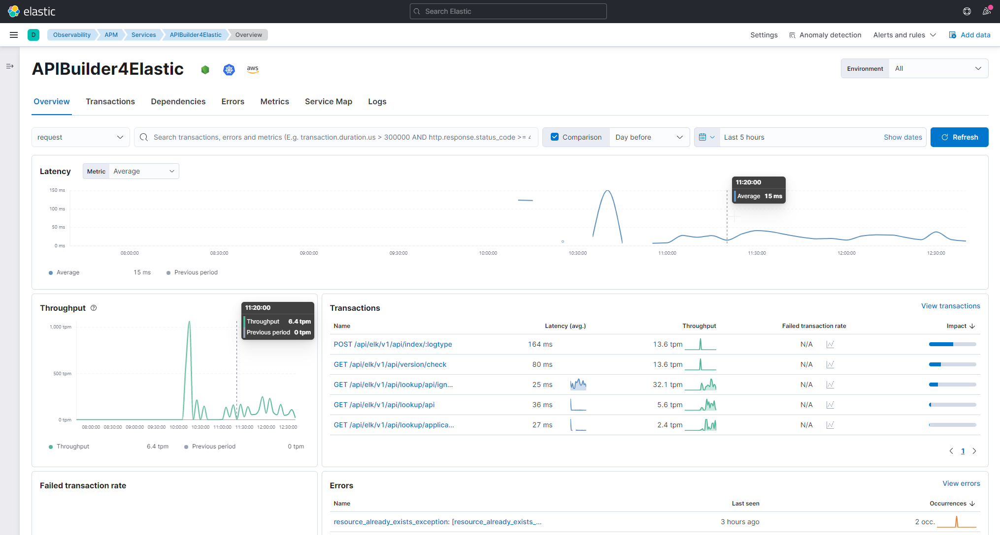

# Application-Performance Monitoring for APIBuilder4Elastic

With [Elastic-APM](https://www.elastic.co/observability/application-performance-monitoring), you can monitor the 
APIBuilder4Elastic better than just using logs directly from the API Builder. Of course, you can also add 
more API-Builder or other containers.  

Once APM is [set up](#setup), you can use Kibana --> Observability --> APM to access a series of application performance 
dashboards. You will find details about throughput, resource consumption, etc. Here are some sample screenshots.

### APM Services overview   


### Selected APIBuilder4Elastic - Overview


### Selected APIBuilder4Elastic - Dependencies


### Selected APIBuilder4Elastic - Errors


### Selected APIBuilder4Elastic - Metrics


## Setup

The solution, respectively the APIBuilder4Elastic, is prepared to use an external APM-Server or to deploy 
directly with the solution. You can enable the APM-Service via Docker Compose in your `.env` file or in the Helm chart.

The activation is divided into 2 steps. The setup and start of the APM server and the connection to the 
APIBuilder4Elastic. Step 1 is of course not necessary if you use an existing external APM server.

### Docker-Compose

#### 1. Start the APM-Server

This launches the APM service as a Docker container. The configured Elasticsearch hosts (`ELASTICSEARCH_HOSTS`) 
and certificates are used to connect to Elasticsearch. If you want to have user login enabled, you also need to 
set the `APM_USERNAME` and `APM_PASSWORD` parameters. Please make sure that the initial setup user must have 
rights to create templates (e.g. the elastic user).

```
docker-compose -f apm/docker-compose.apm-server.yml up -d
```

This starts the APM service as a Docker container:  
```
CONTAINER ID   IMAGE                                                  COMMAND                  CREATED        STATUS                  PORTS                                            NAMES
cdffd8117b8b   docker.elastic.co/apm/apm-server:7.15.2                "/usr/local/scripts/…"   16 hours ago   Up 16 hours             0.0.0.0:8200->8200/tcp                           apm-server
```

To make use of the APM-Service in APIBuilder4Elastic, you need to set the parameter `APM_ENABLED=true`. This will cause the 
API-Builder process to attempt to connect to the configured APM-Server. During start, at the very beginning, the following will be logged: 

#### 2. Activate APM-Service in APIBuilder4Elastic

```
Application performance monitoring enabled. Using APM-Server: https://axway-elk-apm-server:8200
```
If no APM service is specified, then the following default is used: https://apm-server:8200. However, you can configure 
it yourself using the parameter: APM_SERVER. For further parameters please refer to the env-sample.

### Helm

If you are deploying the solution with Helm, please proceed as follows.

#### 1. Start the APM-Server

In your `local-values.yml` you activate the APM server by means of. Additionally, please set the Elasticsearch cluster UUID to 
include the APM server in stack monitoring:  

```yaml
apm-server:
  enabled: true
  elasticsearchClusterUUID: 3hxrsNg6QXq2wSkVWGTD4A
 ```
 
 #### 2. Activate APM-Service in APIBuilder4Elastic
 
 Now you can further configure APIBuilder4Elastic with the following parameters. 
 
 ```yaml
 apibuilder4elastic:
   apmserver:
    # If you want to use an external APM-Server, you can configure the URL here. 
    # Defaults to the internal APM-Server service if enabled
    serverUrl: {}
    # The Certificate-Authory to validate the APM-Server certificate
    # serverCaCertFile: "config/certificates/my-apmserver-ca.crt"
    # You may disable the certificate check
    # verifyServerCert: "false"
 ```
