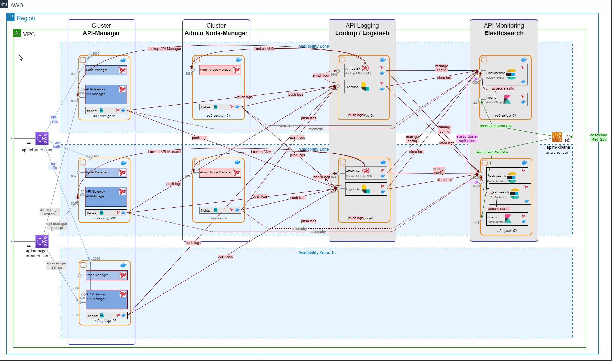

# AWS-Deployment in one region - 2 availbility zones

The solution is completely deployed in this architecture. This means that Kibana, Elasticsearch and Filebeat are all deployed based on the project. 
Some notes on the architecture:
- The solution is highly available with three Elasticsearch nodes.
  - The indicies are stored by Elasticsearch on both nodes (Replica Shards)
  - a shared volume is not necessary
- All clients (Logstash, API-Builder, Filebeat, Kibana) are configured on both available Elasticsearch nodes
  - If one Elasticsearch node fails, the clients use the two nodes
  - the Elasticsearch connection of Filebeat is used for sending telemetry data
- the API builder lookup is done within the availability zone
  - If the API Manager is not available, the documents will continue to be initialized and an error message will be displayed in the traffic monitor 
  
## Architecture overview

## Architecure document

The example architecture is available as a [draw.io](https://www.draw.io/) file and can be used as a starting point for own architectures:  
[apim-on-AWS-elk-monitoring-communication.drawio](apim-on-AWS-elk-monitoring-communication.drawio)  

Contributions from other architectures are welcome. If you have questions or comments, please post an [issue](https://github.com/Axway-API-Management-Plus/apigateway-openlogging-elk/issues/new/choose) here on GitHub.
