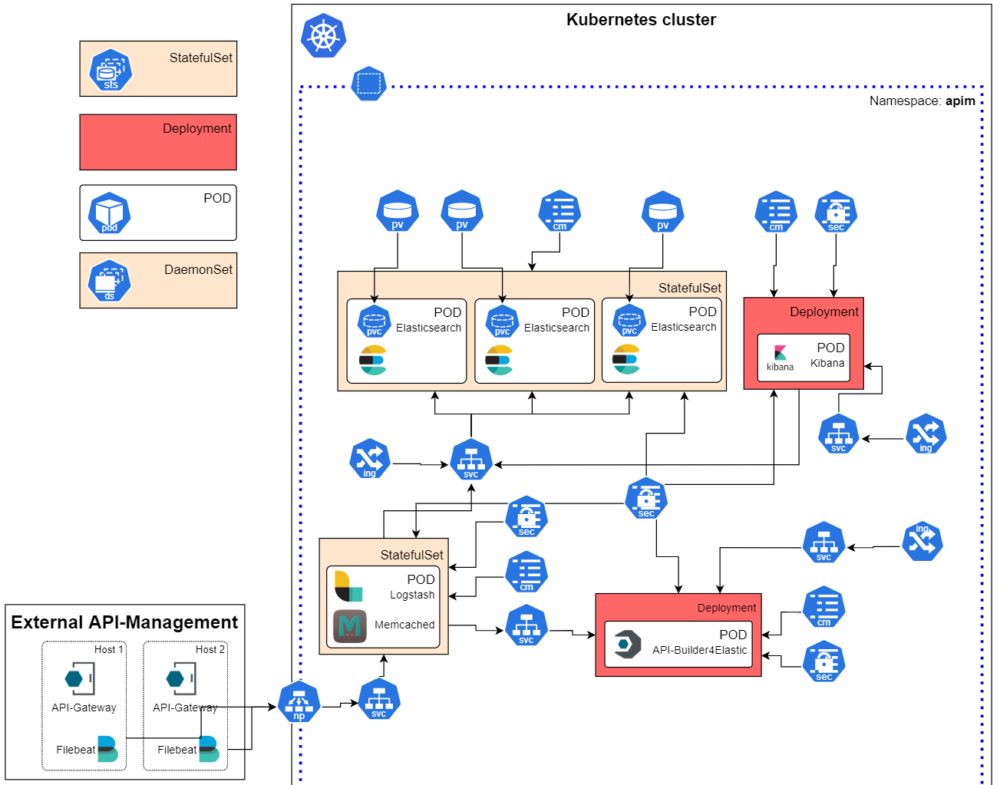
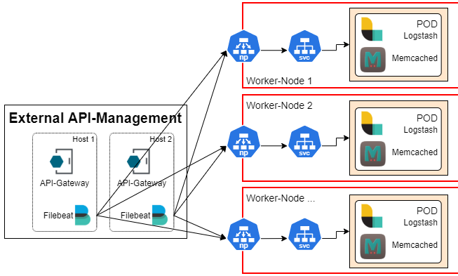
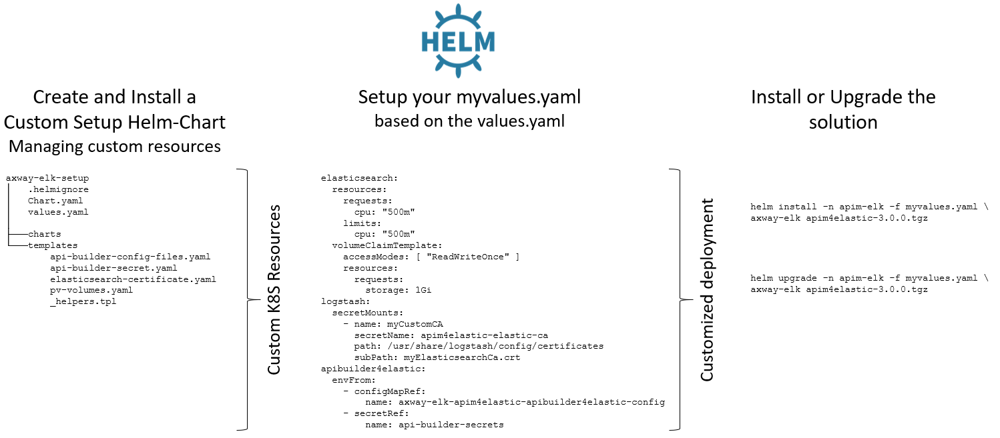
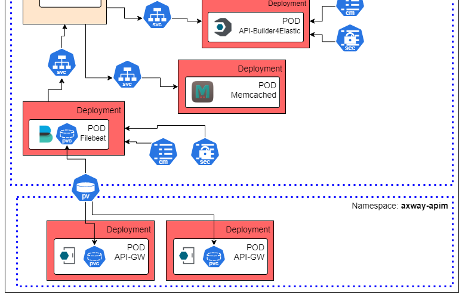

# Axway APIM-Management4Elastic - Helm-Chart

This page provides information on how to deploy the Axway API Management for Elastic solution on a Kubernetes or 
OpenShift cluster using Helm.  
The provided Helm chart is extremely flexible and configurable. You can decide which components to deploy, 
use your own labels, annotations, secrets, and volumes to customize the deployment to your needs.

## Requirements

- Kubernetes >= 1.19
  - At least two dedicated woker nodes for two Elasticsearch instances
- Helm >= 3.3.0
- kubectl installed and configured
- OpenShift (not yet tested (Please create an issue if you need help))
- See [required resources](#required-resources)
- Strongly recommended to have an Ingress-Controller already installed
  - See https://kubernetes.io/docs/concepts/services-networking/ingress-controllers/

Even though this Helm chart makes deploying the solution on Kubernetes/OpenShift much easier, extensive knowledge 
about Kubernetes/OpenShift and Helm is mandatory.  
You must be familiar with:  
- Concepts of Helm, How to create a Helm-Chart, Install & Upgrade
- Kubernetes resources such as Deployments, ConfigMaps, Secrets
- Kubernetes networking, Ingress, Services and Load-Balancing
- Kubernetes Persistent Volumes, Volumes, Volume-Mounts

We try to help to the best of our knowledge within the framework of this project, but we cannot cover every environment and its specifics.

## Architecture overview

The following figure shows an overview of the architecture to be deployed in the Kubernetes cluster. The example 
is for an environment where the API management platform is external to Kubernetes, so Filebeat is also external.  

Further deployment options and customizations are described in this document.  



### Get started

Watch this video to see how to deploy the solution on Kubernetes:  
[](https://youtu.be/w4n9JcBA-X4)

Here it is explained how you could start the solution with minimal setup. Nevertheless, you need sufficient [resources](#required-resources) for it, if you take over the standard resources defined by the [`values.yaml`](values.yaml). In the further course of the document how you can include your own Secrets, Volumes or adjust the required resources.  
Create your own `myvalues.yaml` based on the standard [`values.yaml`](values.yaml) and configure needed parameters. All of the parameters are explained in detail in the charts [`values.yaml`](values.yaml).  

The following represents the most simple `myvalues.yaml` assuming the API-Management Plattform + Filebeat is running externally to the Kubernetes cluster as indicated in the illustration above:  

```yaml
apibuilder4elastic: 
  anmUrl: "https://my-admin-node-manager:8090"
  secrets: 
    apimgrUsername: "apiadmin"
    apimgrPassword: "changeme"
# Enable, if you would like to deploy a new Elasticsearch cluster for the solution
elasticsearch:
  enabled: true
  volumeClaimTemplate:
    accessModes: [ "ReadWriteOnce" ]
    resources:
      requests:
        storage: 1Gi
# Enable, if you would like to deploy Kibana for the solution
kibana:
  enabled: true
```

Please check the [`values.yaml`](values.yaml) for all possible configuration options. You can get a copy of the file above with:  
```
wget https://raw.githubusercontent.com/Axway-API-Management-Plus/apigateway-openlogging-elk/develop/helm/examples/myvalues.yaml
```

### Elasticsearch Persistent volumes

As Elasticsearch is enabled in the previous example two PersistentVolumes, one for each Elasticsearch node, are required. So, first, create two persistent volumes.  

The following should help you to get started, but these volumes are HostPath volumes pointing to a Worker-Node directory - This is not for production. For production use, use appropriate persistent volumes according to your environment/infrastructure. How to set this up is out of scope for this documentation.  
Make sure to create a directory `/tmp/data` on your WorkerNodes and give it permissions for everybody.

```
kubectl apply -n apim-elk -f https://raw.githubusercontent.com/Axway-API-Management-Plus/apigateway-openlogging-elk/develop/helm/misc/pv-vol1.yaml
kubectl apply -n apim-elk -f https://raw.githubusercontent.com/Axway-API-Management-Plus/apigateway-openlogging-elk/develop/helm/misc/pv-vol2.yaml
```

### Install the Helm-Chart

With Elasticsearch volumes and your `myvalues.yaml` file in place, you can start the installation:  
```
helm install -n apim-elk -f myvalues.yaml axway-elk https://github.com/Axway-API-Management-Plus/apigateway-openlogging-elk/releases/download/v3.4.0/helm-chart-apim4elastic-v3.4.0.tgz
```
👉 __Please note:__ The Helm Release-Name: __axway-elk__ is mandatory. Read [here](#why-helm-release-name-axway-elk) why.  

You may run the following commands to check the status of the deployment, pods, services, etc.
```
// Check the installed release
helm list -n apim-elk
NAME            NAMESPACE       REVISION        UPDATED                                 STATUS          CHART                           APP VERSION   
axway-elk       apim-elk        1               2021-05-03 14:22:08.9325287 +0200 CEST  deployed        apim4elastic-3.0.0              3.0.0

// Check the pods, with Elasticsearch and Kibana enabled
kubectl get pods -n apim-elk
NAME                                                         READY   STATUS    RESTARTS   AGE 
axway-elk-apim4elastic-apibuilder4elastic-65b5d56d77-5hv9z   1/1     Running   1          7h2m
axway-elk-apim4elastic-elasticsearch-0                       1/1     Running   0          7h2m
axway-elk-apim4elastic-elasticsearch-1                       1/1     Running   0          7h2m
axway-elk-apim4elastic-kibana-7c6d4b675f-dnxj7               1/1     Running   0          7h2m
axway-elk-apim4elastic-logstash-0                            1/1     Running   0          7h2m
axway-elk-apim4elastic-memcached-56b7447d9-25xwb             1/1     Running   0          7h2m

// Check deployed services
kubectl -n apim-elk get service
NAME                                                TYPE        CLUSTER-IP      EXTERNAL-IP   PORT(S)             AGE
axway-elk-apim4elastic-apibuilder4elastic           ClusterIP   None            <none>        8443/TCP            7h7m
axway-elk-apim4elastic-elasticsearch                ClusterIP   10.100.85.132   <none>        9200/TCP,9300/TCP   7h7m
axway-elk-apim4elastic-elasticsearch-headless       ClusterIP   None            <none>        9200/TCP,9300/TCP   7h4m
axway-elk-apim4elastic-kibana                       ClusterIP   10.105.84.214   <none>        5601/TCP            7h7m
axway-elk-apim4elastic-logstash                     NodePort    10.103.53.111   <none>        5044:32001/TCP      7h7m
axway-elk-apim4elastic-logstash-headless            ClusterIP   None            <none>        9600/TCP            7h7m
axway-elk-apim4elastic-memcached                    ClusterIP   10.108.48.131   <none>        11211/TCP           7h7m

// Desribe a certain POD
kubectl -n apim-elk describe pod axway-elk-apim4elastic-elasticsearch-0

// Get the logs for a POD
kubectl -n apim-elk logs axway-elk-apim4elastic-apibuilder4elastic-65b5d56d77-5hv9z
```

If everything goes well and you Ingress-Configuration is running fine, you can access the different components on the following host-names:  

https://kibana.apim4elastic.local  
https://apibuilder.apim4elastic.local  
https://elasticsearch.apim4elastic.local  

👉 This assumes, that Ingress is configured and DNS-Resolution for `apim4elastic.local` points to your cluster IP. Of course you can configure different Ingress-Hostnames. More details is out of scope for this document.

At this point, it is still assumed, that the API-Management Plattform is running externally. Therefore, as the next step, you need to connect one or more Filebeats to Logstash running in Kubernetes. 

## Logstash and Filebeat

The communication between Filebeat and Logstash is a persistent TCP connection. This means that once the connection has been etsablished, it will continue 
to be used for the best possible throughput. If you specify multiple Logstash instances in your Filebeat configuration, then Filebeat will establish multiple 
persistent connections and uses all of the them for load balancing and failover.   

In the case of Kubernetes/OpenShift, multiple Logstash instances are running behind a Kubernetes service, which acts like a load balancer. However, due to the persistent connection, the load balancer/service cannot really distribute the load. Therefore, for high volumes, it is still the better option to let Filebeat do the load balancing.  

### 1. NodePort Service

By default, the Helm chart deploys a NodePort service for Logstash and with that it becomes available on the configured port: `32001` on all nodes of the cluster.  
You can now setup the corresponding nodes as Logstash hosts in your Filebeat configuration with Load-Balancing enabled and Filebeat will distribute the 
Traffic accross the available Logstashes. With that, it works almost the same as with the Docker-Compose deployment, as Filebeat establishes multiple persistent 
connections.  
The following diagram illustrates the approach:  

  

This is an example setup:  
```
// The service exposing Logstash as a NodePort on 32001
kubectl -n apim-elk get services axway-elk-apim4elastic-logstash -o wide
NAME                              TYPE       CLUSTER-IP      EXTERNAL-IP   PORT(S)          AGE   SELECTOR
axway-elk-apim4elastic-logstash   NodePort   10.110.89.215   <none>        5044:32001/TCP   85m   app=axway-elk-apim4elastic-logstash,chart=logstash,release=axway-elk

// The given NodePort (default 32001) is exposed on all Worker-Nodes:
kubectl get nodes -o wide
NAME                            STATUS   ROLES                  AGE   VERSION   INTERNAL-IP     EXTERNAL-IP   OS-IMAGE         KERNEL-VERSION                  CONTAINER-RUNTIME
ip-172-31-51-209.ec2.internal   Ready    <none>                 23h   v1.21.0   172.31.51.209   <none>        Amazon Linux 2   4.14.209-160.339.amzn2.x86_64   docker://19.3.13
ip-172-31-53-214.ec2.internal   Ready    <none>                 23h   v1.21.0   172.31.53.214   <none>        Amazon Linux 2   4.14.193-149.317.amzn2.x86_64   docker://19.3.6
ip-172-31-54-120.ec2.internal   Ready    <none>                 23h   v1.21.0   172.31.54.120   <none>        Amazon Linux 2   4.14.209-160.339.amzn2.x86_64   docker://19.3.13
ip-172-31-61-143.ec2.internal   Ready    control-plane,master   23h   v1.21.0   172.31.61.143   <none>        Amazon Linux 2   4.14.181-142.260.amzn2.x86_64   docker://19.3.6
```

And this would be the belonging configuration for the Filebeat Logstash output  
```yaml
output.logstash:
  # Based on our tests, the more WorkerNodes you add, the more likely the traffic 
  # is evenly distributed
  hosts: ["172.31.51.209:32001", "172.31.53.214:32001", "172.31.54.120:32001"]
  # Or as part of the .env:
  # LOGSTASH_HOSTS=172.31.51.209:32001,172.31.53.214:32001,172.31.54.120:32001
  worker: 2
  bulk_max_size: 3072
  loadbalance: true
  # Required for the NodePort service approach to give Filebeat a chance to recognize 
  # and use additional Logstash instances that have been provisioned. 
  # 5m was determined to be the best value for the highest possible throughput. 
  # Values lower than 5 minutes may cause an error in Filebeat described here:
  # https://www.elastic.co/guide/en/beats/filebeat/current/publishing-ls-fails-connection-reset-by-peer.html
  ttl: 2m
  # Required to make TTL working
  pipelining: 0
```

The NodePort Service without any Load-Balancer in between is the recommended approach for the best possible throughput. This has been tested with up to 1.000 TPS using 4 Logstash instances and a 5 Node-Elasticsearch cluster.  

### 2. Load Balancer

If you prefer to use a Load-Balancer to have a single entry point it's also possible. You can re-configure the Logstash service from a NodePort to a LoadBalancer and use for instance your Public-Cloud Load-Balancer, from AWS, GCP, etc.  
With that kind of setup, care must be taken to ensure that Filebeat is set with an appropriate [TTL](https://www.elastic.co/guide/en/beats/filebeat/7.12/logstash-output.html#_ttl) to improve the load is at least better distributed between the available Logstash instances. (See here for more details https://github.com/elastic/beats/issues/661). However, it's still random to which Logstash instances connections are established. So, you might see situations where Logstash-Instances are on Idle and other under heavy load.  

For example:  
```yaml
output.logstash:
  # Or as part of the .env:
  # LOGSTASH_HOSTS=172.31.51.209:32001,172.31.53.214:32001,172.31.54.120:32001
  hosts: ["logstash.on.load-balancer:5044"]
  worker: 2
  bulk_max_size: 3072
  # This parameter has not effect, as there is only one Logstash host configured
  loadbalance: true
  # The following two parameters drop & re-establish the connection to Logstash every 5 minutes
  # With that, you give the Service/LoadBalancer from time to time the chance to distribute the traffic. 
  # But even with that, it might be the case, that call traffic goes to one Logstash instance.
  # Do not set the ttl less than 1 minute, as it would increase the connection management overhead
  ttl: 2m
  # Required to make TTL working
  pipelining: 0
```

If you would like to read more: https://discuss.elastic.co/t/filebeat-only-goes-to-one-of-the-logstash-servers-that-is-behind-an-elb/48875/5

## Enable User-Authentication

Enabling user authentication in Elasticsearch is quite analogous to the Docker Compose approach. For a newly created Elasticsearch cluster, 
you generate passwords for the default Elasticsearch users and then store them in your `myvalues.yaml` or in your own secrets.  

Run the following command to generate the passwords for the default users.
```
kubectl -n apim-elk exec axway-elk-apim4elastic-elasticsearch-0 -- bin/elasticsearch-setup-passwords auto --batch --url https://localhost:9200
```

This structure shows how to setup the Elasticsearch users in your `myvalues.yaml` and disable anonymous access.

```yaml
apibuilder4elastic:
  secrets:
    elasticsearchUsername: "elastic"
    elasticsearchPassword: "XXXXXXXXXXXXXXXXXXXX"
logstash:
  logstashSecrets:
    # Used to send stack monitoring information
    logstashSystemUsername: "logstash_system"
    logstashSystemPassword: "AAAAAAAAAAAAAAAAAA"
    # Used to send events
    logstashUsername: "elastic"
    logstashPassword: "XXXXXXXXXXXXXXXXXXXX"
kibana:
  kibanaSecrets:
    username: "kibana_system"
    password: "ZZZZZZZZZZZZZZZZZ"
filebeat:
  filebeatSecrets: 
    beatsSystemUsername: "beats_system"
    beatsSystemPassword: "YYYYYYYYYYYYYYYYYYY"
  # Required for the internal stack monitoring to work with Filebeat
  elasticsearchClusterUUID: "YOUR-CLUSTER-UUID-ID"
# Required for the Elasticsearch readiness check, once users have been generated
elasticsearch:
  elasticsearchSecrets: 
    elasticUsername: "elastic"
    elasticPassword: "BBBBBBBBBBBBBBBBBBBBBB"
  anonymous: 
    enabled: false
```

## Customize the setup

To customize the solution according to your needs, you can configure it using your own Secrets, ConfigMaps, etc.

We recommend that you create your own Helm chart that contains all the necessary resources.  
You then link your custom resources in your `myvalues.yaml` for the final deployment of the solution. The following illustrates the recommended approach:  



### Create your own Helm-Chart
```
helm create axway-elk-setup
cd axway-elk-setup
```
Customize the generated Helm chart according to your needs and remove stuff that is not needed. Based on a few examples it's explained below how to customize the solution.  

### Use a Secret for API-Manager Username & Password

The following example explains how you can create a secret, that keeps the API-Manager username and password and use it with API-Builder. The same procedure applies for all confidential information. Please check [`values.yaml`](values.yaml) for more details.  

#### 1. Create a secret

Use for instance the following command to create a secret that contains the API-Manager Username and Password and store the result in Helm-Chart template folder.
```
kubectl create secret generic api-builder-secrets --from-literal=API_MANAGER_PASSWORD=changeme --from-literal=API_MANAGER_USERNAME=apiadmin --dry-run -o yaml > templates/api-builder-secret.yaml
```
#### 2. Template it

Optionally you may change the generated Yaml file to really become a more flexible Helm-Template.

#### 3. Install or upgrade your setup chart
```
helm install -n apim-elk axway-elk-setup .
NAME: axway-elk-setup
LAST DEPLOYED: Tue May  4 14:17:49 2021
NAMESPACE: apim-elk
STATUS: deployed
REVISION: 1
TEST SUITE: None
```
#### 4. Reference the secret

Adjust your `myvalues.yaml` to reference the created secret. Additionally you have to declare the default ConfigMap, if you don't want to manage that ConfigMap yourself.

```yaml
apibuilder4elastic:
  envFrom:
    - configMapRef:
        name: axway-elk-apim4elastic-apibuilder4elastic-config
    - secretRef:
        name: api-builder-secrets
  # Optionally you can disable the secrets driven by the values.yaml
  secrets: 
    enabled: false
```

#### 5. Install or Upgrade the APIM4Elastic solution

Now you can install or upgrade the solution and in the process your Secret will inject the API Manager username and password into the API Builder container:
```
helm install -n apim-elk -f myvalues.yaml axway-elk apim4elastic-3.0.0.tgz
```

### Custom certificates

By default, necessary keys and certificates are automatically generated in a Secret: `axway-elk-apim4elastic-certificates` and included in the corresponding containers.  
There are a number of keys and certificates all issued by a single CA. All components trust certificates of this CA, which is especially necessary for the communication with Elasticsearch.
If you use an external Elasticsearch cluster, then the corresponding CA of this cluster must be included in the environment.  

This is how you include an external Elasticsearch certificate into the solution. It is also assumed here that the resources, i.e. certificates and keys, are managed via the `axway-elk-setup` Helm chart. 

#### 1. Create a secret containing your CA
```
kubectl create secret generic apim4elastic-elastic-ca --from-file=myElasticsearchCa.crt=myElasticsearchCa.crt --dry-run -o yaml > templates/elasticsearch-certificate.yaml
```

#### 2. Template it

Optionally you may change the generated Yaml file to really become a more flexible Helm-Template.

#### 3. Install or upgrade your setup chart
```
helm upgrade -n apim-elk -f myvalues.yaml axway-elk https://github.com/Axway-API-Management-Plus/apigateway-openlogging-elk/releases/download/v3.1.0/helm-chart-apim4elastic-v3.1.0.tgz
Release "axway-elk-setup" has been upgraded. Happy Helming!
NAME: axway-elk-setup
LAST DEPLOYED: Tue May  4 15:06:30 2021
NAMESPACE: apim-elk
STATUS: deployed
REVISION: 2
TEST SUITE: None
```
#### 4. Reference the CA

To use the custom CA, it must be included appropriately in all containers. To do this, modify your `myvalues.yaml` as shown here in the Logstash example. 
If you do not control all keys and certificates yourself, you must continue to reference the secret: `axway-elk-apim4elastic-certificates`, otherwise it 
will not be included by the new declaration and some keys from the default certificates are missing.

```yaml
logstash:
  secretMounts: 
    - name: certificates
      secretName: axway-elk-apim4elastic-certificates
      path: /usr/share/logstash/config/certificates
    - name: myCustomCA
      secretName: apim4elastic-elastic-ca
      path: /usr/share/logstash/customConfig/certificates
      # The subPath is not really needed, when mounting into a different folder
      subPath: myElasticsearchCa.crt
```
You can declare secret mounts in the same way for each component. After you provide each component with the additional secret, you can store the path to its CA in your `myvalues.yaml`.

```yaml
global:
  elasticsearchCa: "customConfig/certificates/myElasticsearchCa.crt"
```
This tells every component to read the CA for Elasticsearch from this location.

#### 5. Install or Upgrade the APIM4Elastic solution

```
helm upgrade -n apim-elk -f myvalues.yaml axway-elk https://github.com/Axway-API-Management-Plus/apigateway-openlogging-elk/releases/download/v3.1.0/helm-chart-apim4elastic-v3.1.0.tgz
```

### Example Custom-API-Builder Configuration

For some functions, like Local-API-Lookup, you need to inject your own configuration files into the API-Builder4Elastic Container. Here we explain how this works using the example of a custom user authorization.

#### 1. Create ConfigFile configMap

Create a ConfigMap that contains your custom configuration file: 

```yaml
apiVersion: v1
kind: ConfigMap
metadata:
  name: apibuilder4elastic-authz-config
data:
  myAuthzConfig.js: |
    const path = require('path');
    const fs = require('fs');

    /*
        By default, the solution uses user's API Manager organization to determine which 
        API-Requests they are allowed to see in the API Gateway Traffic-Monitor. 
        This behavior can be customized. 
    */

    var authorizationConfig = {
        // For how long should the information cached by the API-Builder process
        cacheTTL: parseInt(process.env.EXT_AUTHZ_CACHE_TTL) ? process.env.EXT_AUTHZ_CACHE_TTL : 300,
        // If you would like to disable user authorization completely, set this flag to false
        enableUserAuthorization: true,
        // Authorize users based on their API-Manager organization (this is the default)
        apimanagerOrganization: {
            enabled: true
        },
    ....
    ..
    .
```

#### 2. Template it

Optionally you may change the generated Yaml file to really become a more flexible Helm-Template.  

Tip: When using Helm use `.Files.get.` to include your custom configuration file. See here for an example: [templates/elasticApimLogstash/logstash-pipelines.yaml](templates/elasticApimLogstash/logstash-pipelines.yaml)

#### 3. Install or upgrade your setup chart

```
helm upgrade -n apim-elk axway-elk-setup .
Release "axway-elk-setup" has been upgraded. Happy Helming!
NAME: axway-elk-setup
LAST DEPLOYED: Tue May  4 15:06:30 2021
NAMESPACE: apim-elk
STATUS: deployed
REVISION: 2
TEST SUITE: None
```

#### 4. Mount the ConfigFile

Now mount this ConfigMap into the API-Builder container and reference it in the configuration using the `values.yaml`:

```yaml
apibuilder4elastic:
  extraVolumes:
  - name: my-authz-config
    mountPath: /app/config
    subPath: myAuthzConfig.js
    
  extraVolumeMounts:
    - name: my-authz-config
      configMap:
        name: apibuilder4elastic-authz-config
```

Finally, tell API-Builder4Elastic to use your custom configuration:

```yaml
apibuilder4elastic:
  authzConfig: "./config/myAuthzConfig.js"
```

#### 5. Install or Upgrade the APIM4Elastic solution
```
helm upgrade -n apim-elk -f myvalues.yaml axway-elk https://github.com/Axway-API-Management-Plus/apigateway-openlogging-elk/releases/download/v3.1.0/helm-chart-apim4elastic-v3.1.0.tgz
```

## API-Management running in Kubernetes

If you are already running the Axway API management solution in a Kubernetes environment, then it makes sense to also run Filebeat in Kubernetes.

The following shows Filebeat and API-Management in a Kubernetes cluster:  

  

One way to provide Filebeat with the necessary log files of the API-Gateway in a central persistent volume. All API-Gateways write to this volume and Filebeat reads & streams the corresponding documents/events.  

### Filebeat using a shared persistent volume

Add the log volume into the Filebeat container using `extraVolumes` and mount it in the correct location using `extraVolumeMounts`. You can find sample configuration in `values.yaml`. Make sure to mount the volume only once.  

Here is one example using a pre-configured AWS-EBS volume: 

```yaml
apiVersion: v1
kind: PersistentVolume
metadata:
  name: opentraffic-pv-volume
spec:
  capacity:
    storage: 3Gi
  accessModes:
  - ReadWriteOnce
  persistentVolumeReclaimPolicy: Retain
  storageClassName: gp2
  awsElasticBlockStore:
    fsType: "ext4"
    volumeID: "vol-0b4396115b8eb52d3"
---
apiVersion: v1
kind: PersistentVolumeClaim
metadata:
  annotations:
  name: opentraffic-pv-claim
spec:
  accessModes:
  - ReadWriteOnce
  resources:
    requests:
      storage: 3Gi
  volumeName: opentraffic-pv-volume
```
And the following goes into your `myvalues.yaml`:
```yaml
filebeat:
  enabled: true
  elasticsearchClusterUUID: "XXXXXXXXXXXXXXXXXXXXX"

  extraVolumeMounts:
    - name: opentraffic
      mountPath: /var/opentraffic

  extraVolumes:
    - name: opentraffic
      persistentVolumeClaim:
        claimName: opentraffic-pv-claim
```

Of course, this a very basic example just to explain the concept. More sophisticated options are possible and perhaps even recommended depending on your infrastructure.

## Upgrade the release

Example how to upgrade an existing Helm release:  
```
helm upgrade -n apim-elk -f myvalues.yaml axway-elk https://github.com/Axway-API-Management-Plus/apigateway-openlogging-elk/releases/download/v3.1.0/helm-chart-apim4elastic-v3.1.0.tgz
```

## Required resources

The following resources were determined to be able to process up to 1,000 TPS in real-time. However, this is the absolute maximum and you should add more capacity if you have constantly __1.000 TPS__ or above.  
If you have fewer transactions per second, then you can make the platform smaller accordingly. Use the [performance information from the classic deployment](../README.md#size-your-infrastructure) as a reference, since the data is comparable.  

| Component                | Requested Memory | Memory limit | Request CPU | CPU Limit     | Notes                                 |
| :---                     | :---             | :---         | :---        | :---          | :---                                  |
| API-Builder4Elastic 1    | 80Mi             | 150Mi        | 100m        | 100m          | 2 Instances are recommended for HA    |
| API-Builder4Elastic 2    | 80Mi             | 150Mi        | 100m        | 100m          |                                       |
| Logstash incl. Memcached | 6.5Gi            | 6.5Gi        | 2000m       | 4000m         | For 1.000 TPS 4 Logstash instances    |
| Logstash incl. Memcached | 6.5Gi            | 6.5Gi        | 2000m       | 4000m         | are required                          |
| Logstash incl. Memcached | 6.5Gi            | 6.5Gi        | 2000m       | 4000m         | Instance 3                            |
| Logstash incl. Memcached | 6.5Gi            | 6.5Gi        | 2000m       | 4000m         | Instance 4                            |
| Elasticsearch 1          | 14Gi             | 16Gi         | 2000m       | 4000m         | For 1.000 TPS a 5 Node Elasticsearch  |
| Elasticsearch 2          | 14Gi             | 16Gi         | 2000m       | 4000m         | cluster is required                   |
| Elasticsearch 3          | 14Gi             | 16Gi         | 2000m       | 4000m         | Node 3                                |
| Elasticsearch 4          | 14Gi             | 16Gi         | 2000m       | 4000m         | Node 4                                |
| Elasticsearch 5          | 14Gi             | 16Gi         | 2000m       | 4000m         | Node 5                                |
| Kibana                   | 300Mi            | 500Mi        | 500m        | 1000m         |                                       |
| __Total__                | __~97Gi__        | __~140Gi__   | __~19__     | __~38__       | __Supposed to handle up to 1.000 TPS__|

Filebeat is not yet tested as part of the Kubernetes deployment. Memory is ap. between 150Mi and 250Mi. CPU between 500m and 1000m.  

For Elasticsearch the maximum number of file descriptors must be at least 65536. (See for instance here: https://documentation.sisense.com/latest/linux/dockerlimits.htm)  

## FAQ

### Why Helm Release-Name axway-elk?

The release name must currently: `axway-elk`, because many resources, like Services, ConfigMaps or Secrets 
are created with it and referenced in the standard `values.yaml`. An example is the Elasticsearch-Service: `axway-elk-apim4elastic-elasticsearch`, 
which is for instance used for the standard `elasticsearchHosts: "https://axway-elk-apim4elastic-elasticsearch:9200"`. This restriction may 
be changed in a later release to get more flexibility.  

### Can I use Auto-Scaling?

Apart from API-Builder4Elastic, this is unfortunately not possible. Elasticsearch automatically stores the data on multiple cluster nodes and would have to rebalance the cluster again and again when adding or removing nodes/pods. Logstash also does not offer the option of autoscaling. However you can change the number of PODs for, lets say, Elasticsearch, Logstash at any time. The condition is that they do not change within a short time, otherwise no advantage is gained.

### Can I easily add or remove instances?

Yes, they can change the number of nodes via the scaling function or via their values.yaml using replicas. This works for API-Builder4Elastic, Logstash, Elasticsearch and Kibana.  
For Elasticsearch, make sure the cluster is in Green state before removing a node to avoid data loss. 
If you change the Logstash instances, it is recommended to restart all Filebeat instances afterwards. The reason for this are the persistent connections. You may also need to adjust the filebeat configuration.

### How can I increase the disk space for Elasticsearch?

If Elasticsearch is running in Kubernetes as a StatefulSet, you can increase the disk space as follows. 
1. Make sure that the StorageClass you are using supports volumeExpansion. 
allowVolumeExpansion: true
2. Edit existing PVC for already running PoDs and increase the capacity
3. Update the VolumeClaimTemplate in your Helm values  
```
  volumeClaimTemplate:
    accessModes: [ "ReadWriteOnce" ]
    storageClassName: gp2
    resources:
      requests:
        storage: 100Gi
```
4. Now delete the StatefulSet without deleting the pods.  
   `kubectl -n apim delete sts axway-elk-apim4elastic-elasticsearch --cascade=orphan`
5. Perform a helm upgrade to reinstall the modified StatefulSet
6. Redeploy the PODs of the stateful set  
   `kubectl -n apim rollout restart sts axway-elk-apim4elastic-elasticsearch`
