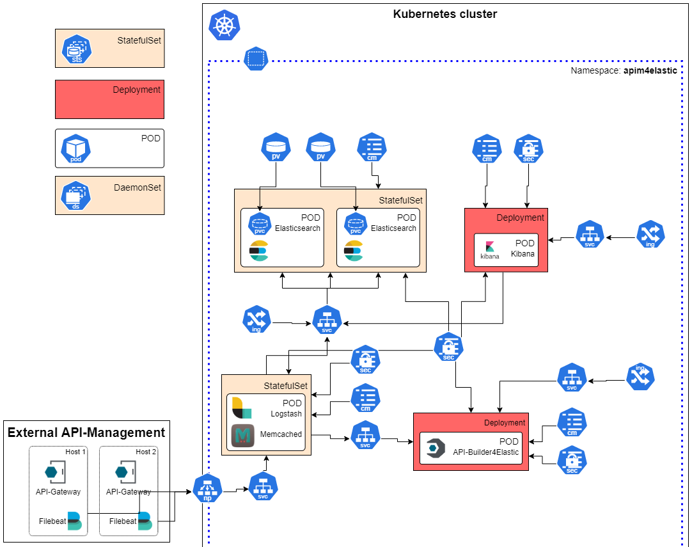
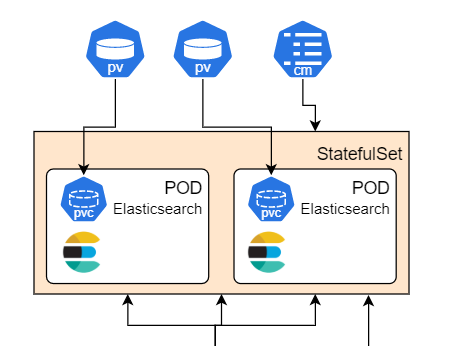
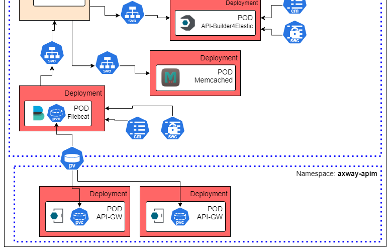

# # Axway APIM-Management4Elastic - Helm-Chart

This page provides information on how to deploy the Axway API Management for Elastic solution on a Kubernetes or 
OpenShift cluster using Helm.  
The provided Helm chart is extremely flexible and configurable. You can decide which components to deploy, 
use your own labels, annotations, secrets, and volumes to customize the deployment to your needs.

## Requirements

- Kubernetes >= 1.19
- Helm >= 3.3.0
- OpenShift (not yet tested (Please create an issue if you need help))
- See [required resources](#required-resources)

Even though this Helm chart makes deploying the solution on Kubernetes/OpenShift much easier, extensive knowledge 
about Kubernetes/OpenShift and Helm is mandatory.  
You must be familiar with:  
- Concepts of Helm, How to create a Helm-Chart, Install & Upgrade
- Kubernetes resources such as ConfigMaps, Secrets
- Kubernetes networking, Ingress, Services and Load-Balancing
- Kubernetes Persistent Volumes, Volumes, Volume-Mounts

We try to help to the best of our knowledge within the framework of this project, but we cannot cover every environment and its specifics.

## Usage notes

The following explains how to deploy the solution on your Kubernetes/OpenShift using the provided Helm chart. We start with a simple deployment 
that includes all components except Filebeat. This deployment is useful if there is no existing Elasticsearch cluster + Kibana and 
API-Management is running on classic virtual machines externally to the Kubernetes.  

The resources are deployed in Kubernetes as follows:  


### Configuration

Create your own `myvalues.yaml` based on the standard [`values.yaml`](values.yaml) and configure required parameters. All of the parameters are 
explained in details in the charts [`values.yaml`](values.yaml).  
The following contains a list of parameters that needs to be set very likely for each deployment: 

| Parameter                                   | Description                                                                                                                                                             
|---------------------------------------------|-------------------------------------------------------------------------------------------------------------------------------------------------------------------------|
| `global.elasticsearchHosts`                 | The Elasticsearch Host Service, Elasticsearch should be running in K8S/OpenShift. For an external Elasticsearch service, specify the Elasticsearch host addresses.      |                                                                                                  |
| `apibuilder4elastic.enabled`                | Controls if API-Buider4Elastic should be deployed. Defaults to true. Required component along with Logstash and Memcached                              |
| `apibuilder4elastic.anmUrl`                 | The URL of the Axway API Gateway admin node manager. Please note that the address must be reachable from the API Builder.                                               |
| `apibuilder4elastic.apimgrUrl`              | The URL of the Axway API Gateway admin node manager. Please note that the address must be reachable from the API Builder.                                               |
| `apibuilder4elastic.secrets.apimgrUsername` | Username used by API-Builder to authenticate at the API-Manager. Must be an Admin-User. Default is set to apiadmin                                                      |
| `apibuilder4elastic.secrets.apimgrPassword` | Password used by API-Builder to authenticate at the API-Manager. Default is set to changeme                                                                             |
| `logstash.enabled`                          | Controls if Logstash should be deployed. Defaults to true. Required component along with API-Builder4Elastic and Memcached                              |
| `memached.enabled`                          | Controls if Memcached should be deployed. Defaults to true. Required component along with API-Builder4Elastic and Logstash                               |
| `elasticsearch.enabled`                     | Controls if [Elasticsearch should be provisioned](#provision-elasticsearch). Defaults to false. Enable it if you plan to use an external Elasticsearch cluster          |
| `elasticsearch.replicas`                    | Number of Elasticsearch nodes to provision. Defaults to 2 nodes.                                                                                                        |
| `kibana.enabled`                            | Controls if Kibana should be provisioned as part of Helm-Install. Defaults to false. Enable it if you plan to use an external Kibana application                      |
| `filebeat.enabled`                          | Controls if Filebeat should be provisioned as part of Helm-Install. Defaults to false. Enable it if the API-Management solution runs in your Kubernetes                 |

Depending on the desired deployment options, additional parameters must be set in your myValues.yaml. Some of the deployment options are explained below.

## Prepare Elasticsearch

If you have `elasticseach.enabled` set to true, you need to create for each Elasticsearch node (number of `elasticsearch.replicas`) a persistent volume. The persisent volume must match to the configured `elasticsearch.volumeClaimTemplate`.  
Furthermore, each replica must have a worker node available, since one Elasticsearch node is deployed per worker node.  

  

For a production environment, you should provision an appropriate [persistent volumes](https://kubernetes.io/docs/concepts/storage/persistent-volumes/) 
depending on your environment.

For testing purposes, you can create simple a [hostpath volume](https://kubernetes.io/docs/concepts/storage/volumes/#hostpath). 

Example hostpath volume you may create for testing:  
```yaml
apiVersion: v1
kind: PersistentVolume
metadata:
  labels:
    app: elasticsearch-master
  name: pv-vol1
spec:
  accessModes:
  - ReadWriteOnce
  capacity:
    storage: 1Gi
  hostPath:
    path: /tmp/data
    type: ""
  persistentVolumeReclaimPolicy: Retain
  volumeMode: Filesystem
```

Create the volume:
```
kubectl apply -n apim-elk -f pv-vol1.yaml
```

This volume will bound to the following example `elasticsearch.volumeClaimTemplate`:  
```yaml 
  volumeClaimTemplate:
    accessModes: [ "ReadWriteOnce" ]
    resources:
      requests:
        storage: 1Gi
```

### Install the Helm-Chart

__Please note__ that the release name must currently: `axway-elk`, because many resources, like Services, ConfigMaps or Secrets 
are created with it and referenced in the standard `values.yaml`. An example is the Elasticsearch-Service: `axway-elk-apim4elastic-elasticsearch`, 
which is for instance used for the standard `elasticsearchHosts: "https://axway-elk-apim4elastic-elasticsearch:9200"`. This restriction may 
be changed in a later release to get more flexibility.  

To deploy the solution execute the following command:
```
helm install -n apim-elk -f myvalues.yaml axway-elk apim4elastic-3.0.0.tgz

// Check the installed release
helm list -n apim-elk
NAME            NAMESPACE       REVISION        UPDATED                                 STATUS          CHART                           APP VERSION   
axway-elk       apim-elk        1               2021-05-03 14:22:08.9325287 +0200 CEST  deployed        apim4elastic-3.0.0              3.0.0

// Check the pods, with Elasticsearch and Kibana enabled
kubectl get pods -n apim-elk
NAME                                                         READY   STATUS    RESTARTS   AGE 
axway-elk-apim4elastic-apibuilder4elastic-65b5d56d77-5hv9z   1/1     Running   1          7h2m
axway-elk-apim4elastic-elasticsearch-0                       1/1     Running   0          7h2m
axway-elk-apim4elastic-elasticsearch-1                       1/1     Running   0          7h2m
axway-elk-apim4elastic-kibana-7c6d4b675f-dnxj7               1/1     Running   0          7h2m
axway-elk-apim4elastic-logstash-0                            1/1     Running   0          7h2m
axway-elk-apim4elastic-memcached-56b7447d9-25xwb             1/1     Running   0          7h2m

// Check deployed services
kubectl -n apim-elk get service
NAME                                                TYPE        CLUSTER-IP      EXTERNAL-IP   PORT(S)             AGE
axway-elk-apim4elastic-apibuilder4elastic-service   ClusterIP   None            <none>        8443/TCP            7h7m
axway-elk-apim4elastic-elasticsearch                ClusterIP   10.100.85.132   <none>        9200/TCP,9300/TCP   7h7m
axway-elk-apim4elastic-elasticsearch-headless       ClusterIP   None            <none>        9200/TCP,9300/TCP   7h4m
axway-elk-apim4elastic-kibana                       ClusterIP   10.105.84.214   <none>        5601/TCP            7h7m
axway-elk-apim4elastic-logstash                     NodePort    10.103.53.111   <none>        5044:32001/TCP      7h7m
axway-elk-apim4elastic-logstash-headless            ClusterIP   None            <none>        9600/TCP            7h7m
axway-elk-apim4elastic-memcached                    ClusterIP   10.108.48.131   <none>        11211/TCP           7h7m
```

### Upgrade the release

Example how to upgrade an existing Helm release:  
```
helm upgrade -n apim-elk -f myvalues.yaml axway-elk apim4elastic-3.1.0.tgz
```

## API-Management running in Kubernetes

If you are already running the Axway API management solution in a Kubernetes environment, then it makes sense to also run Filebeat in Kubernetes.

The following shows Filebeat and API-Management in a Kubernetes cluster:  
  

One way to provide Filebeat with the necessary log files of the API gateway is a central volume. The API gateways write to this volume and Filebeat reads & streams the corresponding documents/events.  

Mount the log volume in the filebeat container using `extraVolumes` and mount it in the correct location using `extraVolumeMounts`. You can find sample configuration in Values.yaml.

Other variants are possible, but have not yet been tested.

## Logstash and Filebeat

The communication between Filebeat and Logstash is a maintained TCP connection which is sticky. In the classic deployment using for instance Docker-Compose, you would configure 
the available Logstash instances as a list in Filebeat. With that Filebeat performs the load balancing on its own.  
In the case of Kubernetes things are a bit different, there are basically two ways to make the Logstash service externally available:

1. __Node Port__  
Here the administrative effort is higher, but it can be worthwhile from the throughput to set up the Logstash service as a node port and to configure Filebeat accordingly on all nodes. 
You need to know, that per default the Logstash Node-Affinity makes sure, that only 1 Logstash is deployed per Kubernetes worker node. 
Of course, you can connect an appropriate external load balancer in front of the exposed node port. Please note also in this case to set a TTL value for filebeat. See further below.

NodePort is enabled by default and exposes Logstash on port: 32001 on each Node.

2. __Load Balancer__  

If you run the platform in a cloud environment, such as GCP, AWS, etc., you can use load balancers to automatically provision an external IP address for Logstash. However, care must be taken to 
ensure that Filebeat is set with an appropriate [TTL](https://www.elastic.co/guide/en/beats/filebeat/7.12/logstash-output.html#_ttl) to ensure that the load is evenly 
distributed between the available Logstash instances. (See here for more details https://github.com/elastic/beats/issues/661)

## Use externally provided Secrets & ConfigMaps

It is recommended to use externally provided Secrets and ConfigMaps especially for Secrets like passwords or certificates. 
All components offer the possibility to use own ConfigMaps and Secretes. These can then be used to make passwords, etc. from 
your own secrets available in containers or to integrate certificates via volume mounts.

For this purpose, it is recommended to deploy a separate Helm chart with the necessary resources before deploying the 
APIM4Elastic solution. After your resources ared create reference these in the APIM4Elastic values.yaml. 

### Example Custom ConfigMap

Create a ConfigMap for the APIBuilder4Elastic:  

```yaml
apiVersion: v1
kind: ConfigMap
metadata:
  name: my-extra-api-builder-config
data:
  ADMIN_NODE_MANAGER: https://my-admin-node:8090
  API_BUILDER_SSL_CERT: "config/certificates/myCustomSSL.crt"
  API_BUILDER_SSL_KEY: "config/certificates/myCustomSSL.key"
  API_MANAGER: https://my-api-manager:8075
  API_BUILDER_LOCAL_API_LOOKUP_FILE: "config/myLocalLookupFile.json"
  AUTHZ_CONFIG: "config/myAuthZConfig.json"
  ELASTICSEARCH_HOSTS: https://my-elasticsearch-host:9200
```

In reality you should create your resources with HELM, but this is out of scope for this documentation:

```
kubectl apply -n apim-elk -f myAPIBuilder.yaml
```

In the values.yaml reference your ConfigMap: 

```yaml
apibuilder4elastic:
  # Injects the environment variables from the ConfigMaps and Secrets into the 
  # APIBuilder4Elastic pod. Specify your own ConfigMaps or Secrets if you don't
  # provide Configuration and Secrets as part of this values.yaml.
  envFrom: 
    - configMapRef:
        name: my-extra-api-builder-config
    - secretRef:
        name: axway-elk-apim4elastic-apibuilder4elastic-secret
```

Analogously, of course, you have the same option for Secrets, Volumes, VolumeMounts to include the necessary resources in the containers.

### Example Custom-API-Builder Configuration

Create a ConfigMap that contains your custom configuration file: 

```yaml
apiVersion: v1
kind: ConfigMap
metadata:
  name: apibuilder4elastic-authz-config
data:
  myAuthzConfig.js: |
    const path = require('path');
    const fs = require('fs');

    /*
        By default, the solution uses user's API Manager organization to determine which 
        API-Requests they are allowed to see in the API Gateway Traffic-Monitor. 
        This behavior can be customized. 
    */

    var authorizationConfig = {
        // For how long should the information cached by the API-Builder process
        cacheTTL: parseInt(process.env.EXT_AUTHZ_CACHE_TTL) ? process.env.EXT_AUTHZ_CACHE_TTL : 300,
        // If you would like to disable user authorization completely, set this flag to false
        enableUserAuthorization: true,
        // Authorize users based on their API-Manager organization (this is the default)
        apimanagerOrganization: {
            enabled: true
        },
    ....
    ..
    .
```

Tip: When using HELM use `.Files.get.` to include your custom configuration file. See here for an example: [templates/elasticApimLogstash/logstash-pipelines.yaml](templates/elasticApimLogstash/logstash-pipelines.yaml)

```
kubectl apply -n apim-elk -f myAPIBuilderAuthZConfig.yaml
```

Now mount this ConfigMap into the API-Builder container and reference it in the configuration using the `values.yaml`:

```yaml
apibuilder4elastic:
  extraVolumes:
  - name: my-authz-config
    mountPath: /app/config
    subPath: myAuthzConfig.js
    
  extraVolumeMounts:
    - name: my-authz-config
      configMap:
        name: apibuilder4elastic-authz-config
```

Finally, tell API-Builder4Elastic to use your custom configuration:

```yaml
apibuilder4elastic:
  authzConfig: "./config/myAuthzConfig.js"
```

## Required resources

### API-Builder4Elastic

Memory: 50Mi - 80Mi
CPU: 100m - 200m

### Memcached

Memory: 32Mi - 64Mi
CPU: 50m - 100m

### Logstash

Memory: 6Gi - 6Gi
CPU: 1000m - 1000m

### Elasticsearch

Memory: 2Gi - 2Gi
CPU: 1000m - 1000m

### Kibana

Memory: 500m - 500m
CPU: 500m - 500m