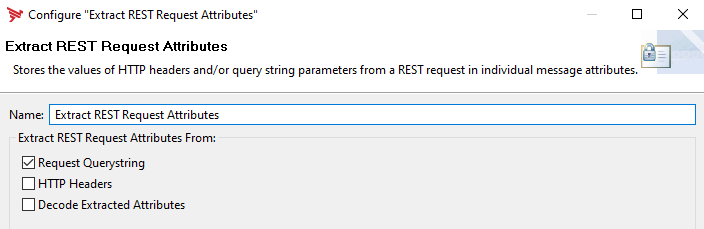
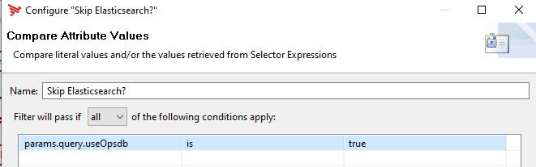
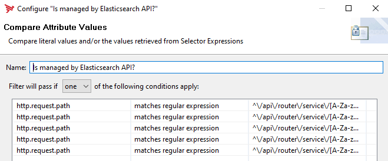

# Configure Admin-Node-Manager Policy

It's recommended to use the provided Policy-Fragment: [policy-use-elasticsearch-api-7.7.0.xml](nodemanager/policy-use-elasticsearch-api-7.7.0.xml). 
Howevery, if you like to setup the policy you find the details here.

## How to create the policy manually

1. Create a new policy and name it `Use Elasticsearch API` - *This Policy will decide on what API calls can be routed to Elasticsearch*
- Finally, the configured Policy should look like this:

    

### Extract REST Request Attributes

This filter is used to extract given REST-API Query-Parameters into attributes, which is required to get the optional parameter: `useOpsdb` which can be used to skip Elasticsearch and use the internal OPSDB.  

  

### Skip Elasticsearch?

This compare attribute filter is used to check if the parameter: `useOpsdb` is `true`. If true, Elasticsearch is not used for the request.  
:point_right: In order to make use of this optional parameter you have to configure it in your <apigateway>/config/acl.json as an allowed parameter like so otherwise the ANM will return a 403 error:  
`"ops_get_messages" : { "path" : "/ops/search?protocol=&format=&from=&count=&order=&rorder=&ago=&field=&value=&op=&jmsPropertyName=&jmsPropertyValue=&useOpsdb=" },`  

  

### Is managed by Elasticsearch API?

The `Compare Attribute` filter named `Is managed by Elasticsearch API?` checks for each endpoint based on the attribute: `http.request.path` if the requested API can be handled by the API-Builder ElasticSearch-Traffic-Monitor API.  
As a basis for decision-making a criteria for each endpoint needs to be added to the filter configuration.  
_The following endpoints are currently supported by the API Builder based Traffic-Monitor API._  

| Endpoint       | Expression               | Comment | 
| :---          | :---                 | :---  |
| **Search**     | `^\/api\/router\/service\/[A-Za-z0-9-.]+\/ops\/search$` | This endpoint which provides the data for the HTTP Traffic overview and all filtering capabilities|
| **Circuitpath**     | `^\/api\/router\/service\/[A-Za-z0-9-.]+\/ops\/stream\/[A-Za-z0-9]+\/[^\/]+\/circuitpath$` | Endpoint which provides the data for the Filter Execution Path as part of the detailed view of a transaction|
| **Trace**     | `^\/api\/router\/service\/[A-Za-z0-9-.]+\/ops\/trace\/[A-Za-z0-9]+[\?]?.*$` | Endpoint which returns the trace information and the **getinfo** endpoint which returns the request detail information including the http header of each leg|
| **GetInfo**     | `^\/api\/router\/service\/[A-Za-z0-9-.]+\/ops\/[A-Za-z0-9]+\/[A-Za-z0-9]+\/[\*0-9]{1}\/getinfo[\?]?.*$` |Endpoint provides information for the Requesr- Response-Details|
| **Payload**     | `^\/api\/router\/service\/[A-Za-z0-9-.]+\/ops\/stream\/.*\/\d+\/(?:sent|received)$` |Payload endpoint|


The compare attribute filter should look like this:   
  

### Set region filter

This `Set Attribute` filter: `Set region filter` creates a new attribute: `regionFilter`, which is used during the connect to restrict the result based on the region of the Admin-Node-Manager. It's using the environment variable: `env.REGION`. This is optional.  

  

Sample:  `region=${env.REGION == '[invalid field]' ? "" : env.REGION}`

### Add region filter

Adds the region filter, which is optional to the `http.request.rawURI` attribute.

```javascript
function invoke(msg) {
    var httpRequestRawURI = msg.get("http.request.rawURI");
    var regionFilter = msg.get("regionFilter");

    if (httpRequestRawURI.contains('?')) {
        httpRequestRawURI += "&" + regionFilter;
    } else {
        httpRequestRawURI += "?" + regionFilter;
    }
    msg.put("http.request.rawURI", httpRequestRawURI);
    return true;
}
```

### Connect to Elasticsearch API

The URL of the Connect to URL filter points to your running API-Builder docker container and port - **default is 8889** using the environment variable: `API_BUILDER_URL`.  
Additionally the URL is forwarding the optional region filter based on the configured `REGION` to make sure, the Admin-Node-Manager loads the correct regional data.  
Sample: `${env.API_BUILDER_URL}/api/elk/v1${http.request.rawURI}${regionFilter}`  
  

### Is not implemented
Is not implemented is a `Compare attribute` filter configured like so:  
  
